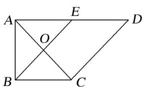
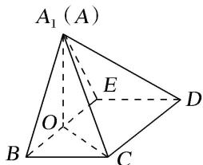

<!-- question-source:start -->
[例 1]如图 1，在直角梯形 ABCD 中， $AD \parallel BC$ ， $\angle BAD = \frac{\pi}{2}$ ， $AB = BC = \frac{1}{2}AD = a$ ，E 是 AD 的中点，O 是 AC 与 BE 的交点．将 $\triangle ABE$ 沿 BE 折起到图 2 中 $\triangle A_{1}BE$ 的位置，得到四棱锥 $A_{1} - BCDE$ .

(1)证明： $CD \perp$ 平面 $A_{1}OC$ ;

(2)当平面 $A_{1}BE \perp$ 平面 BCDE 时，四棱锥 $A_{1}-BCDE$ 的体积为 $36\sqrt{2}$ ，求 a 的值.

  
图1  
图2
<!-- question-source:end -->

![[高中/总复习/专题/立体几何/专题10 立体几何中的面积与体积问题-立体几何（文科）/考点02_几何体的体积问题/例题/answers/Q00043708A1.md]]
