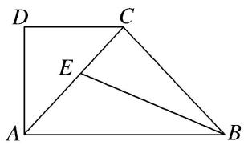
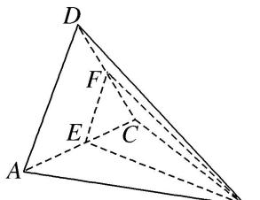

<!-- question-source:start -->
[例 2]如图①, 在直角梯形 $ABCD$ 中, $\angle ADC = 90^\circ$ , $AB \parallel CD$ , $AD = CD = \frac{1}{2} AB = 2$ , $E$ 为 $AC$ 的中点, 将 $\triangle ACD$ 沿 $AC$ 折起, 使折起后的平面 $ACD$ 与平面 $ABC$ 垂直, 如图②. 在图②所示的几何体 $D-ABC$ 中.

  
图①

  
图②

(1)求证： $BC \perp$ 平面 ACD;

(2)点 F 在棱 CD 上，且满足 $AD \parallel$ 平面 BEF，求几何体 F-BCE 的体积.

(1) $\because AC = \sqrt{AD^2 + CD^2} = 2\sqrt{2}, \angle BAC = \angle ACD = 45^\circ, AB = 4,$

∴在△ABC中， $BC^{2}=AC^{2}+AB^{2}-2AC\times AB\times\cos45^{\circ}=8,\quad\therefore AB^{2}=AC^{2}+BC^{2}=16,\quad\therefore AC\perp BC,$

∵平面 $ACD \perp$ 平面 ABC，平面 $ACD \cap$ 平面 ABC = AC， $BC \subset$ 平面 ABC，∴ $BC \perp$ 平面 ACD.

(2)∵AD//平面BEF，AD⊂平面ACD，平面 $ACD\cap$ 平面BEF=EF，∴AD//EF，

∵E为AC的中点，∴EF为△ACD的中位线，

$$
\text {由
(1)知，} V _ {F - B C E} = V _ {B - C E F} = \frac {1}{3} \times S _ {\triangle C E F} \times B C, S _ {\triangle C E F} = \frac {1}{4} S _ {\triangle A C D} = \frac {1}{4} \times \frac {1}{2} \times 2 \times 2 = \frac {1}{2}, \therefore V _ {F - B C E} = \frac {1}{3} \times \frac {1}{2} \times 2 \sqrt {2} = \frac {\sqrt {2}}{3}.
$$
<!-- question-source:end -->

![[高中/总复习/专题/立体几何/专题10 立体几何中的面积与体积问题-立体几何（文科）/考点02_几何体的体积问题/例题/answers/Q00043709A1.md]]
