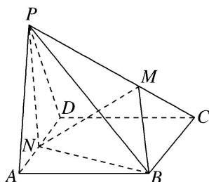
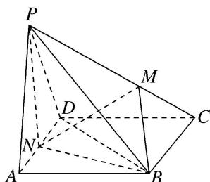

<!-- question-source:start -->
[例 3]如图，在四棱锥 P-ABCD 中，底面 ABCD 是菱形， $\angle BAD=60^{\circ}$ ，PA=PD=AD=2，点 M 在线段 PC 上，且 PM=2MC，N 为 AD 的中点.

(1)求证： $AD \perp$ 平面 PNB;

(2)若平面 $PAD \perp$ 平面 ABCD，求三棱锥 P-NBM 的体积.

(1)连接 BD. $\because PA=PD$ ，N 为 AD 的中点， $\therefore PN\perp AD$ .

又底面 ABCD 是菱形， $\angle BAD=60^{\circ}$ ，∴ $\triangle ABD$ 为等边三角形，∴ $BN \perp AD$ ，

又 $PN \cap BN = N, \therefore AD \perp$ 平面 PNB.

(2) $\because PA=PD=AD=2,\quad\therefore PN=NB=\sqrt{3}.$

又平面 $PAD \perp$ 平面 ABCD，平面 $PAD \cap$ 平面 ABCD = AD， $PN \perp AD$ ，∴ $PN \perp$ 平面 ABCD，$\therefore PN \perp NB, \therefore S_{\triangle PNB} = \frac{1}{2} \times \sqrt{3} \times \sqrt{3} = \frac{3}{2}. \because AD \perp$ 平面 $PNB, AD // BC, \therefore BC \perp$ 平面 $PNB.$ 又 $PM = 2MC,$ $\therefore V_{P-NBM} = V_{M-PNB} = \frac{2}{3} V_{C-PNB} = \frac{2}{3} \times \frac{1}{3} \times \frac{3}{2} \times 2 = \frac{2}{3}.$
<!-- question-source:end -->

![[高中/总复习/专题/立体几何/专题10 立体几何中的面积与体积问题-立体几何（文科）/考点02_几何体的体积问题/例题/answers/Q00043710A1.md]]
