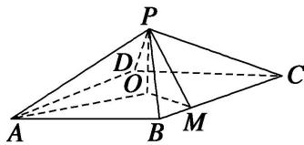

<!-- question-source:start -->
[例 4](2014·重庆)如图，四棱锥 P-ABCD 中，底面是以 O 为中心的菱形， $PO \perp$ 底面 ABCD，AB=2， $\angle BAD=\frac{\pi}{3}$ ，M 为 BC 上一点，且 $BM=\frac{1}{2}$ .

(1)证明： $BC \perp$ 平面 POM;

(2)若 $MP \perp AP$ ，求四棱锥 P-ABMO 的体积.

<!-- question-source:end -->

![[高中/总复习/专题/立体几何/专题10 立体几何中的面积与体积问题-立体几何（文科）/考点02_几何体的体积问题/例题/answers/Q00043711A1.md]]
