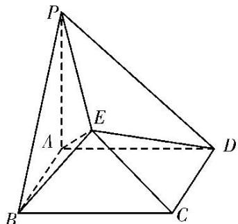

<!-- question-source:start -->
[例5]如图，正方形ABCD的边长为2， $PA\bot$ 平面ABCD， $PA = 2$ ，平面 $EBC\bot$ 平面ABCD， $EB = EC$ $= \sqrt{2}$

(1)在 $CD$ 上是否存在一点 $F$ ，使得 $BF \perp$ 平面 $PAE$ ？若存在，确定点 $F$ 的位置；若不存在，请说明理由.

(2)求多面体 PABCDE 的体积.

<!-- question-source:end -->

![[高中/总复习/专题/立体几何/专题10 立体几何中的面积与体积问题-立体几何（文科）/考点02_几何体的体积问题/例题/answers/Q00043712A1.md]]
