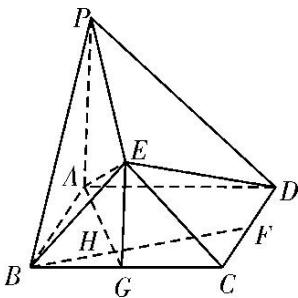

<!-- question-source:start -->
[例5]如图，正方形ABCD的边长为2， $PA\bot$ 平面ABCD， $PA = 2$ ，平面 $EBC\bot$ 平面ABCD， $EB = EC$ $= \sqrt{2}$

(1)在 $CD$ 上是否存在一点 $F$ ，使得 $BF \perp$ 平面 $PAE$ ？若存在，确定点 $F$ 的位置；若不存在，请说明理由.

(2)求多面体 PABCDE 的体积.

(1)在 $CD$ 上存在点 $F$ 满足题意，且点 $F$ 为 $CD$ 的中点．证明如下：

如图，取 BC 的中点 G，连接 AG，GE，由 BC=2， $EB=EC=\sqrt{2}$ 得 $EG\perp BC$ ，且 EG=1。又平面 $EBC\perp$ 平面 ABCD，平面 $EBC\cap$ 平面 ABCD=BC，

所以 $EG \perp$ 平面 $ABCD$ ，又 $PA \perp$ 平面 $ABCD$ ， $PA = 2$ ，所以 $EG \parallel \frac{1}{2} PA$ ， $P$ ， $A$ ， $E$ ， $G$ 四点共面.

取 CD 的中点 F，连接 BF，在正方形 ABCD 中，易得 $\angle BAG = \angle CBF$ ，所以 $BF \perp AG$ ，

又 $PA \perp$ 平面 $ABCD$ , $BF \subset$ 平面 $ABCD$ , 所以 $BF \perp PA$ , 又 $PA \cap AG = A$ , 所以 $BF \perp$ 平面 $PAE$ .

(2)多面体 PABCDE 的体积 $V_{PABCDE}=V_{E-PAB}+V_{E-PAD}+V_{E-ABCD}$ .

因为 $EG \parallel PA$ ， $PA \subset$ 平面 $PAB$ ，所以 $EG \parallel$ 平面 $PAB$ ，

即点 E 到平面 PAB 的距离与点 G 到平面 PAB 的距离相等，

同理可证点 E 到平面 PAD 的距离与点 C 到平面 PAD 的距离相等.

所以 $V_{E-PAB}=\frac{1}{3}\times\frac{1}{2}\times2\times2\times1=\frac{2}{3}$ ，所以 $V_{E-PAD}=\frac{1}{3}\times\frac{1}{2}\times2\times2\times2=\frac{4}{3}$

所以 $V_{E-ABCD}=\frac{1}{3}\times2\times2\times1=\frac{4}{3}$ ，故 $V_{PABCDE}=\frac{10}{3}$ .

【对点训练】
<!-- question-source:end -->

![[高中/总复习/专题/立体几何/专题10 立体几何中的面积与体积问题-立体几何（文科）/考点02_几何体的体积问题/例题/answers/Q00043712A1.md]]
