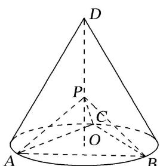

<!-- question-source:start -->
[例 1](2020·全国I)如图，D 为圆锥的顶点，O 是圆锥底面的圆心， $\triangle ABC$ 是底面的内接正三角形，P 为 DO 上一点， $\angle APC=90^{\circ}$ .

(1)证明：平面 $PAB \perp$ 平面 PAC;

(2)设 $DO = \sqrt{2}$ ，圆锥的侧面积为 $\sqrt{3}\pi$ ，求三棱锥 $P - ABC$ 的体积.

(1)由题设可知， $PA=PB=PC$ ．由△ABC是正三角形，可得△PAC≌△PAB，△PAC≌△PBC.又∠APC=90°，故∠APB=90°，∠BPC=90°.

从而 $PB \perp PA$ ， $PB \perp PC$ ，又 PA， $PC \subset$ 平面 PAC， $PA \cap PC = P$ ，

故 $PB \perp$ 平面 PAC，又 $PB \subset$ 平面 PAB，所以平面 $PAB \perp$ 平面 PAC.

(2)设圆锥的底面半径为 r，母线长为 l，由题设可得 $rl=\sqrt{3}$ ， $l^{2}-r^{2}=2$ ，解得 r=1， $l=\sqrt{3}$ .

从而 $AB=\sqrt{3}$ . 由
(1)可得 $PA^{2}+PB^{2}=AB^{2}$ ，故 PA=PB=PC= $\frac{\sqrt{6}}{2}$ .

所以三棱锥 P-ABC 的体积为 $\frac{1}{3}\cdot\frac{1}{2}\cdot PA\cdot PB\cdot PC=\frac{1}{3}\times\frac{1}{2}\times\left(\frac{\sqrt{6}}{2}\right)^{3}=\frac{\sqrt{6}}{8}$ .
<!-- question-source:end -->

![[高中/总复习/专题/立体几何/专题10 立体几何中的面积与体积问题-立体几何（文科）/考点02_几何体的体积问题/例题/answers/Q00043717A1.md]]
