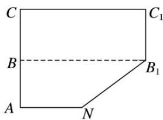
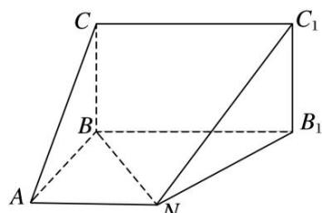
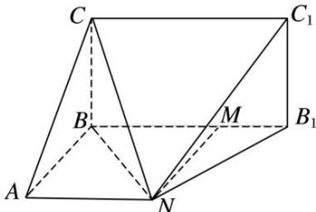

<!-- question-source:start -->
[例 4]五边形 $ANB_{1}C_{1}C$ 是由一个梯形 $ANB_{1}B$ 与一个矩形 $BB_{1}C_{1}C$ 组成的，如图甲所示，B 为 AC 的中点， $AC = CC_{1} = 2AN = 8$ 。沿虚线 $BB_{1}$ 将五边形 $ANB_{1}C_{1}C$ 折成直二面角 A— $BB_{1}$ —C，如图乙所示。

(1)求证：平面 $BNC \perp$ 平面 $C_1B_1N$ ;

(2)求图乙中的多面体的体积.

  
图甲  
图乙

(1)四边形 $BB_{1}C_{1}C$ 为矩形，故 $B_{1}C_{1}\bot BB_{1}$ ，又由于二面角 $A—BB_{1}—C$ 为直二面角，故 $B_{1}C_{1}\bot$ 平面 $BB_{1}A$ ，又 $BN\subset$ 平面 $BB_{1}A$ ，故 $B_{1}C_{1}\bot BN$

由线段 $AC = CC_{1} = 2AN = 8$ 知， $BB_{1}^{2} = NB_{1}^{2} + BN^{2}$ ，即 $BN \perp NB_{1}$ ，又 $B_{1}C_{1} \cap NB_{1} = B_{1}$ ，

$B_{1}C_{1}$ ， $NB_{1}\subset$ 平面 $NB_{1}C_{1}$ ，所以 $BN\perp$ 平面 $C_{1}B_{1}N$ ，因为 $BN\subset$ 平面BNC，所以平面 $BNC\perp$ 平面 $C_{1}B_{1}N$ .

(2)连接 CN，过 N 作 $NM \perp BB_{1}$ ，垂足为 M， $V_{三棱锥 C—ABN} = \frac{1}{3} \times BC \cdot S_{\triangle ABN} = \frac{1}{3} \times 4 \times \frac{1}{2} \times 4 \times 4 = \frac{32}{3}$ ,

又 $B_{1}C_{1}\perp$ 平面 $ABB_{1}N$ ，所以平面 $CBB_{1}C_{1}\perp$ 平面 $ABB_{1}N$

且平面 $CBB_{1}C_{1}\cap ABB_{1}N=BB_{1}$ ， $NM\perp BB_{1}$ ， $NM\subset$ 平面 $ABB_{1}N$ ，所以 $NM\perp$ 平面 $B_{1}C_{1}CB$ ，

$V_{四棱锥N-B_{1}C_{1}CB}=\frac{1}{3}\times NM\cdot S_{矩形B_{1}C_{1}CB}=\frac{1}{3}\times4\times4\times8=\frac{128}{3},$

则此几何体的体积 $V=V_{三棱锥 C—ABN}+V_{四棱锥 N—B_{1}C_{1}CB}=\frac{32}{3}+\frac{128}{3}=\frac{160}{3}.$

【对点训练】
<!-- question-source:end -->

![[高中/总复习/专题/立体几何/专题10 立体几何中的面积与体积问题-立体几何（文科）/考点02_几何体的体积问题/例题/answers/Q00043720A1.md]]
