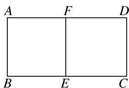
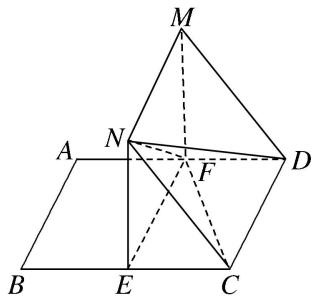

<!-- question-source:start -->
[例 2]如图①，在矩形 ABCD 中，AB=3，BC=4，E，F 分别在线段 BC，AD 上， $EF \parallel AB$ ，将矩形 ABEF 沿 EF 折起，记折起后的矩形为 MNEF，且平面 $MNEF \perp$ 平面 ECDF，如图②.

  
图①

  
图②

(1)求证： $NC \parallel$ 平面 MFD;

(2)若 $EC = 3$ ，求证： $ND\bot FC;$

(3)求四面体 NEFD 体积的最大值.
<!-- question-source:end -->

![[高中/总复习/专题/立体几何/专题10 立体几何中的面积与体积问题-立体几何（文科）/考点02_几何体的体积问题/例题/answers/Q00043727A1.md]]
