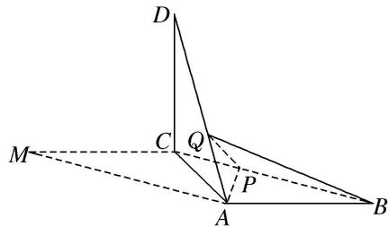

> [!faq]- 《专题10 立体几何中的面积与体积问题-立体几何（文科）》例题解析
>
> > [!success]- **【答案】** 详见解析
>
> > [!note]- **【分析】**
> > 本题未单列分析。
>
> > [!note]- **【解析】**
> > (1)证明：平面 $ACD \perp$ 平面 ABC;
> > (2) $Q$ 为线段 $AD$ 上一点， $P$ 为线段 $BC$ 上一点，且 $BP = DQ = \frac{2}{3} DA$ ，求三棱锥 $Q - ABP$ 的体积.
> > 
> > 解析 (1)由已知可得， $\angle BAC = 90^{\circ}$ ，即 $BA \perp AC$ .
> > 又因为 $BA \perp AD$ ， $AC \cap AD = A$ ，所以 $AB \perp$ 平面 ACD.
> > 因为 $AB \subset$ 平面 ABC，所以平面 $ACD \perp$ 平面 ABC.
> > (2)由已知可得， $DC = CM = AB = 3$ ， $DA = 3\sqrt{2}$ 又 $BP = DQ = \frac{2}{3} DA$ ，所以 $BP = 2\sqrt{2}$
> > 
> > 如图，过点 Q 作 $QE \perp AC$ ，垂足为 E，则 $QE \cong \frac{1}{3} DC$ .
> > 由已知及(1)可得， $DC \perp$ 平面 ABC，所以 $QE \perp$ 平面 ABC，QE = 1.
> > 因此，三棱锥 $Q - ABP$ 的体积为 $V_{Q - ABP} = \frac{1}{3}\times S_{\triangle ABP}\times QE = \frac{1}{3}\times \frac{1}{2}\times 3\times 2\sqrt{2}\sin 45^{\circ}\times 1 = 1.$
