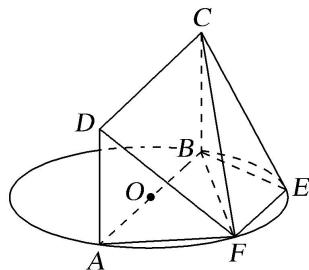
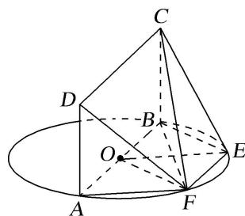

> [!faq]- 《专题10 立体几何中的面积与体积问题-立体几何（文科）》例题解析
>
> > [!success]- **【答案】** 详见解析
>
> > [!note]- **【分析】**
> > 本题未单列分析。
>
> > [!note]- **【解析】**
> > (1)求证：平面 $DAF \perp$ 平面 CBF;
> > (2)若 $BC = 1$ ，求四棱锥 $F - ABCD$ 的体积.
> > 
> > 解析 (1)因为 AB 为圆 O 的直径，点 F 在圆 O 上，所以 $AF \perp BF$ .
> > 又矩形 ABCD 所在平面和圆 O 所在平面垂直，且两平面的交线为 AB， $CB \perp AB$ ， $CB \subset$ 平面 ABCD，所以 $CB \perp$ 圆 O 所在平面，所以 $AF \perp BC$ .
> > 又 BC，BF 为平面 CBF 内两条相交直线，所以 $AF \perp$ 平面 CBF.
> > 又 $AF \subset$ 平面 DAF，所以平面 $DAF \perp$ 平面 CBF.
> > (2)连接 OE, OF, 如图所示,
> > 
> > 因为 AB=2, EF=1, $AB \parallel EF$ ，则四边形 OEFA 为菱形，
> > 所以 AF=OE=OA=1，所以 AF=OA=OF=1，则 $\triangle OAF$ 为等边三角形.
> > 在等边三角形 OAF 中，点 F 到边 OA 的距离为 $\frac{\sqrt{3}}{2}$ .
> > 又矩形 ABCD 所在平面和圆 O 所在平面垂直，且两平面的交线为 AB，
> > 所以点 F 到边 OA 的距离即四棱锥 F-ABCD 的高，所以四棱锥 F-ABCD 的高 $h=\frac{\sqrt{3}}{2}$ .
> > 又 BC=1，所以矩形 ABCD 的面积 $S=AB \times BC = 2 \times 1 = 2$ .
> > 故 $V_{四棱锥 F-ABCD}=\frac{1}{3}\times2\times\frac{\sqrt{3}}{2}=\frac{\sqrt{3}}{3}.$
