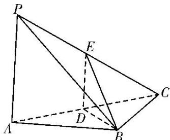
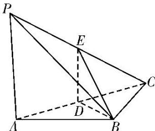

> [!faq]- 《专题10 立体几何中的面积与体积问题-立体几何（文科）》例题解析
>
> > [!success]- **【答案】** 详见解析
>
> > [!note]- **【分析】**
> > 本题未单列分析。
>
> > [!note]- **【解析】**
> > (1)求证： $PA \perp BD;$
> > (2)求证：平面 $BDE \perp$ 平面 PAC;
> > (3)当 $PA \parallel$ 平面 $BDE$ 时，求三棱锥 $E - BCD$ 的体积.
> > 
> > 解析 (1) 因为 $PA \perp AB$ ， $PA \perp BC$ ，所以 $PA \perp$ 平面 ABC.
> > 又因为 $BD \subset$ 平面 ABC，所以 $PA \perp BD$ .
> > 
> > (2)因为 AB=BC，D 为 AC 的中点，所以 $BD \perp AC$ .
> > 由(1)知 $PA \perp BD$ ，所以 $BD \perp$ 平面 PAC。所以平面 $BDE \perp$ 平面 PAC。
> > (3)因为 PA // 平面 BDE，平面 PAC ∩ 平面 BDE = DE，所以 PA // DE.
> > 因为 D 为 AC 的中点，所以 $DE=\frac{1}{2}PA=1,\quad BD=DC=\sqrt{2}.$
> > 由(1)知 $PA \perp$ 平面 ABC，所以 $DE \perp$ 平面 ABC．所以三棱锥 E-BCD 的体积 $V = \frac{1}{6} BD \cdot DC \cdot DE = \frac{1}{3}$ .
