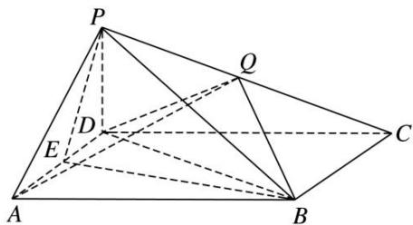
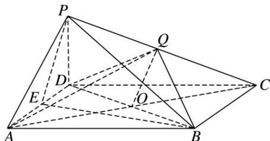

> [!faq]- 《专题10 立体几何中的面积与体积问题-立体几何（文科）》例题解析
>
> > [!success]- **【答案】** 详见解析
>
> > [!note]- **【分析】**
> > 本题未单列分析。
>
> > [!note]- **【解析】**
> > (1)求证： $AD \perp$ 平面 $PBE$ ;
> > (2)若 Q 是 PC 的中点，求证：PA// 平面 BDQ;
> > (3)若 $V_{P-BCDE}=2V_{Q-ABCD}$ ，试求 $\frac{CP}{CQ}$ 的值.
> > 
> > 解析 (1)由 E 是 AD 的中点，PA=PD 可得 $AD \perp PE$ .
> > 因为底面 ABCD 是菱形， $\angle BAD=60^{\circ}$ ，所以 AB=BD，所以 $AD\perp BE$ ，
> > 又 $PE \cap BE = E$ ，PE，BE ⊂ 平面 PBE，所以 $AD \perp$ 平面 PBE.
> > (2)连接 AC，交 BD 于点 O，连接 OQ.
> > 
> > 因为 O 是 AC 的中点，Q 是 PC 的中点，所以 $OQ \parallel PA$ ，
> > 又 $PA \notin$ 平面 $BDQ$ , $OQ \subset$ 平面 $BDQ$ , 所以 $PA \parallel$ 平面 $BDQ$ .
> > (3)设四棱锥 P-BCDE, Q-ABCD 的高分别为 $h_{1}$ , $h_{2}$ . 所以 $V_{四棱锥 P-BCDE}=\frac{1}{3}S_{四边形 BCDE}h_{1}$ ,
> > $V_{四棱锥 Q-ABCD}=\frac{1}{3}S_{四边形 ABCD}h_{2}$ . 又 $V_{P-BCDE}=2V_{Q-ABCD}$ ，且 $S_{四边形 BCDE}=\frac{3}{4}S_{四边形 ABCD}$ ，所以 $\frac{CP}{CQ}=\frac{h_{1}}{h_{2}}=\frac{8}{3}$ .
> > 【对点训练】
