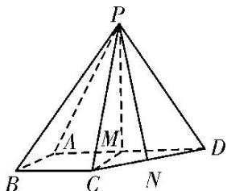

> [!faq]- 《专题10 立体几何中的面积与体积问题-立体几何（文科）》例题解析
>
> > [!success]- **【答案】** 详见解析
>
> > [!note]- **【解析】**
> > 解析
> > (1)在平面 $ABCD$ 中，因为 $\angle BAD = \angle ABC = 90^{\circ}$ 。所以 $BC // AD$
> >
> > 又 $BC \nmid$ 平面 $PAD, AD \subset$ 平面 $PAD$ . 所以直线 $BC \parallel$ 平面 $PAD$ .
> >
> > 
> >
> > (2)如图，取 $AD$ 的中点 $M$ ，连接 $PM$ ， $CM$ ，由 $AB = BC = \frac{1}{2} AD$ 及 $BC // AD$
> >
> > $\angle ABC=90^{\circ}$ 得四边形 ABCM 为正方形，则 $CM\perp AD$ .
> >
> > 因为侧面 PAD 为等边三角形且垂直于底面 ABCD，平面 $PAD \cap$ 平面 ABCD = AD， $PM \subset$ 平面 PAD，
> > 所以 $PM \perp AD$ ， $PM \perp$ 底面 ABCD，因为 $CM \subset$ 底面 ABCD，所以 $PM \perp CM$ .
> > 设 BC = x，则 $CM = x,\quad CD = \sqrt{2}x,\quad PM = \sqrt{3}x,\quad PC = PD = 2x,$
> >
> > 如图，取 $CD$ 的中点 $N$ ，连接 $PN$ ，则 $PN \perp CD$ ，所以 $PN = \frac{\sqrt{14}}{2} x$ 。因为 $\triangle PCD$ 的面积为 $2\sqrt{7}$ 所以 $\frac{1}{2} \times \sqrt{2} x \times \frac{\sqrt{14}}{2} x = 2\sqrt{7}$ ，解得 $x = -2$ (舍去)或 $x = 2$ 。于是 $AB = BC = 2$ ， $AD = 4$ ， $PM = 2\sqrt{3}$ 。
> >
> > 所以四棱锥 $P - ABCD$ 的体积 $V = \frac{1}{3} \times \frac{2 \times (2 + 4)}{2} \times 2\sqrt{3} = 4\sqrt{3}$ .
