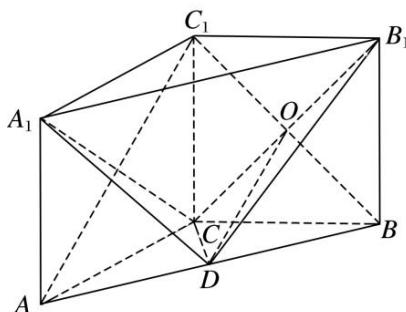

> [!faq]- 《专题10 立体几何中的面积与体积问题-立体几何（文科）》例题解析
>
> > [!success]- **【答案】** 详见解析
>
> > [!note]- **【解析】**
> > 解析
> > (1)连接 $BC_{1}$ 交 $B_{1}C$ 于点 O，连接 OD.
> >
> > 
> >
> > 在三棱柱 $ABC-A_{1}B_{1}C_{1}$ 中，四边形 $BCC_{1}B_{1}$ 是平行四边形，∴点 O 是 $BC_{1}$ 的中点.
> >
> > ∵点D为AB的中点，∴ $OD\parallel AC_{1}$ ．又 $OD\subset$ 平面 $B_{1}CD$ ， $AC_{1}\notin$ 平面 $B_{1}CD$ ，∴ $AC_{1}\parallel$ 平面 $B_{1}CD$ .
> > (2)∵AC=BC, AD=BD, ∴CD⊥AB. 在三棱柱 ABC— $A_{1}B_{1}C_{1}$ 中，
> >
> > 由 $AA_{1} \perp$ 平面 ABC，得平面 $ABB_{1}A_{1} \perp$ 平面 ABC。又平面 $ABB_{1}A_{1} \cap$ 平面 ABC = AB，CD ⊂ 平面 ABC，
> > ∴ CD ⊥ 平面 $ABB_{1}A_{1}$ ，∵ AC ⊥ BC，AC = BC = 2，∴ AB = $A_{1}B_{1} = 2\sqrt{2}$ ，CD = $\sqrt{2}$ ，
> >
> > $$
> > \therefore V _ {\text {三棱锥} A _ {1} - C D B _ {1}} = V _ {\text {三棱锥} C - A _ {1} D B _ {1}} = \frac {1}{3} \times \frac {1}{2} \times 2 \times 2 \sqrt {2} \times \sqrt {2} = \frac {4}{3}.
> > $$
