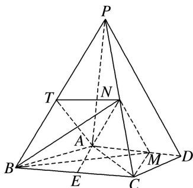

> [!faq]- 《专题10 立体几何中的面积与体积问题-立体几何（文科）》例题解析
>
> > [!success]- **【答案】** 详见解析
>
> > [!note]- **【分析】**
> > 本题未单列分析。
>
> > [!note]- **【解析】**
> > 解析
> > (1)由已知得 $AM = \frac{2}{3} AD = 2$ 。如图，取 $BP$ 的中点 $T$ ，连接 $AT$ ， $TN$ ，
> >
> > 由 $N$ 为 $PC$ 中点知 $TN \parallel BC$ , $TN = \frac{1}{2} BC = 2$ . 又 $AD \parallel BC$ , 故 $TN \underline{\parallel} AM$ ,
> >
> > 所以四边形 AMNT 为平行四边形，于是 MN // AT.
> >
> > 因为 $AT \subset$ 平面 PAB， $MN \notin$ 平面 PAB，所以 $MN \parallel$ 平面 PAB.
> >
> > 
> >
> > (2)因为 $PA \perp$ 平面 ABCD，N 为 PC 的中点，所以 N 到平面 ABCD 的距离为 $\frac{1}{2}PA$ .
> >
> > 取 $BC$ 的中点 $E$ ，连接 $AE$ 。由 $AB = AC = 3$ 得 $AE \perp BC$ ， $AE = \sqrt{AB^2 - BE^2} = \sqrt{5}$ 。
> >
> > 由 $AM \parallel BC$ 得 $M$ 到 $BC$ 的距离为 $\sqrt{5}$ ，故 $S_{\triangle BCM} = \frac{1}{2} \times 4 \times \sqrt{5} = 2\sqrt{5}$ .
> >
> > 所以四面体 N-BCM 的体积 $V_{四面体 N-BCM}=\frac{1}{3}\times S_{\triangle BCM}\times\frac{PA}{2}=\frac{4\sqrt{5}}{3}$ .
