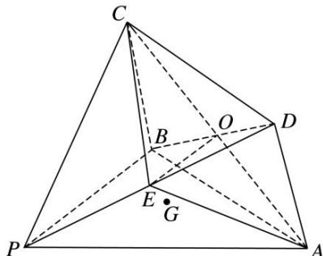

> [!faq]- 《专题10 立体几何中的面积与体积问题-立体几何（文科）》例题解析
>
> > [!success]- **【答案】** 详见解析
>
> > [!note]- **【分析】**
> > 本题未单列分析。
>
> > [!note]- **【解析】**
> > 解析
> > (1) 过 $G$ 点存在直线 $l$ 使 $OE \parallel l$ , 理由如下:
> >
> > 由题意知 O 为 BD 的中点，又 E 为 PD 的中点，所以在 $\triangle PBD$ 中，OE // PB.
> >
> > 若点 G 在直线 PB 上，则直线 PB 即为所求的直线 l，所以有 $OE \parallel l$ ;
> >
> > 若点 G 不在直线 PB 上，在平面 PAB 内，过点 G 作直线 l，使 $l \parallel PB$ ，
> >
> > 又 $OE \parallel PB$ ，所以 $OE \parallel l$ ，即过 G 点存在直线 l 使 $OE \parallel l$ .
> >
> > 
> >
> > (2)连接 EA, EC, 则平面 ACE 将几何体分成两部分: 三棱锥 D—AEC 与几何体 AECBP(如图所示). 因为平面 ABCD⊥平面 PAB, 且交线为 AB, 又 PB⊥AB, PB⊂平面 PAB, 所以 PB⊥平面 ABCD. 故 PB 为几何体 P—ABCD 的高. 又四边形 ABCD 为菱形, ∠ABC=120°, AB=a, PB= $\sqrt{3}a$ ,
> >
> > 所以 $S_{四边形ABCD}=2\times\frac{\sqrt{3}}{4}a^{2}=\frac{\sqrt{3}}{2}a^{2}$ ，所以 $V_{四棱锥P-ABCD}=\frac{1}{3}S_{四边形ABCD}\cdot PB=\frac{1}{3}\times\frac{\sqrt{3}}{2}a^{2}\times\sqrt{3}a=\frac{1}{2}a^{3}$ .
> >
> > 又 $OE \cong \frac{1}{2} PB$ ，所以 $OE \perp$ 平面 $ACD$
> >
> > 所以 $V_{三棱锥 D—AEC}=V_{三棱锥 E—ACD}=\frac{1}{3}S_{\triangle ACD}\cdot EO=\frac{1}{4}V_{四棱锥 P—ABCD}=\frac{1}{8}a^{3}$ ,
> >
> > 所以几何体 AECBP 的体积 $V = V_{四棱锥 P-ABCD} - V_{三棱锥 D-EAC} = \frac{1}{2} a^{3} - \frac{1}{8} a^{3} = \frac{3}{8} a^{3}$ .
> >
> > 【对点训练】
