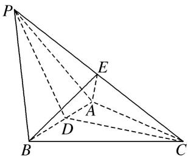

> [!faq]- 《专题10 立体几何中的面积与体积问题-立体几何（文科）》例题解析
>
> > [!success]- **【答案】** B
>
> > [!note]- **【解析】**
> > 解析
> > (1)因为 $\triangle PAB$ 是等边三角形， $\angle APC=\angle BPC=60^{\circ}$ ，所以 $\triangle PBC\cong\triangle PAC$ ，所以 $AC=BC$ .
> >
> > 如图，取 AB 的中点 D，连接 PD, CD，则 $PD \perp AB, CD \perp AB$ ，因为 $PD \cap CD = D$ ，所以 $AB \perp$ 平面 PDC，因为 $PC \subset$ 平面 PDC，所以 $AB \perp PC$ .
> >
> > 
> >
> > (2)由
> > (1)知， $AB \perp PC$ ，又 $BE \perp PC$ ， $AB \cap BE = B$ ，所以 $PC \perp$ 平面 ABE，所以 $PC \perp AE$ 。因为 PB = 4，所以在 Rt△PEB 中， $BE = 4\sin 60^{\circ} = 2\sqrt{3}$ ， $PE = 4\cos 60^{\circ} = 2$ ，
> >
> > 在 Rt△PEA 中， $AE=PE\tan60^{\circ}=2\sqrt{3}$ ，所以 $AE=BE=2\sqrt{3}$ ，所以 $S_{\triangle ABE}=\frac{1}{2}\cdot AB\cdot\sqrt{BE^{2}-\left(\frac{1}{2}AB\right)^{2}}=4\sqrt{2}$ .
> > 所以三棱锥 B-PAE 的体积 $V_{B-PAE}=V_{P-ABE}=\frac{1}{3}S_{\triangle AEB}\cdot PE=\frac{1}{3}\times4\sqrt{2}\times2=\frac{8\sqrt{2}}{3}$ .
