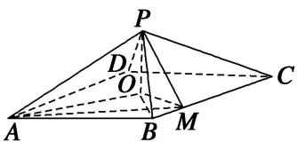

> [!faq]- 《专题10 立体几何中的面积与体积问题-立体几何（文科）》例题解析
>
> > [!success]- **【答案】** 详见解析
>
> > [!note]- **【解析】**
> > 解析
> > (1)如图，因为四边形 ABCD 为菱形，O 为菱形中心，连接 OB，则 $AO \perp OB$ 。因为 $\angle BAD = \frac{\pi}{3}$ ,
> >
> > 
> >
> > 故 $OB=AB\cdot\sin\angle OAB=2\sin\frac{\pi}{6}=1$ ，又因为 $BM=\frac{1}{2}$ ，且 $\angle OBM=\frac{\pi}{3}$ ，在 $\triangle OBM$ 中，
> >
> > $$
> > O M ^ {2} = O B ^ {2} + B M ^ {2} - 2 O B \cdot B M \cdot \cos \angle O B M = 1 ^ {2} + (\frac {1}{2}) ^ {2} - 2 \cdot 1 \cdot \frac {1}{2} \cdot \cos \frac {\pi}{3} = \frac {3}{4}.
> > $$
> >
> > 所以 $OB^{2}=OM^{2}+BM^{2}$ ，故 $OM\perp BM$ 。又 $PO\perp$ 底面 ABCD，所以 $PO\perp BC$ 。
> >
> > 从而 BC 与平面 POM 内两条相交直线 OM，PO 都垂直，所以 BC⊥平面 POM.
> >
> > (2)由
> > (1)可得， $OA = AB\cdot \cos \angle OAB = 2\cdot \cos \frac{\pi}{6} = \sqrt{3}.$
> >
> > 设 $PO = a$ ，由 $PO \perp$ 底面ABCD知， $\triangle POA$ 为直角三角形，故 $PA^2 = PO^2 + OA^2 = a^2 + 3$ .
> >
> > 由 $\triangle POM$ 也是直角三角形，故 $PM^2 = PO^2 + OM^2 = a^2 +\frac{3}{4}$
> >
> > 连接 AM，在 $\triangle ABM$ 中， $AM^{2}=AB^{2}+BM^{2}-2AB\cdot BM\cdot\cos\angle ABM=2^{2}+(\frac{1}{2})^{2}-2\cdot2\cdot\frac{1}{2}\cdot\cos\frac{2\pi}{3}=\frac{21}{4}$
> >
> > 由已知 $MP \perp AP$ ，故 $\triangle APM$ 为直角三角形，则 $PA^{2} + PM^{2} = AM^{2}$ ，即 $a^{2} + 3 + a^{2} + \frac{3}{4} = \frac{21}{4}$ ，
> >
> > 得 $a=\frac{\sqrt{3}}{2}$ ， $a=-\frac{\sqrt{3}}{2}$ （舍去），即 $PO=\frac{\sqrt{3}}{2}$ ，
> >
> > $$
> > S _ {\text {四边形} A B M O} = S _ {\triangle A O B} + S _ {\triangle O M B} = \frac {1}{2} \cdot A O \cdot O B + \frac {1}{2} \cdot B M \cdot O M = \frac {1}{2} \cdot \sqrt {3} \cdot 1 + \frac {1}{2} \cdot \frac {1}{2} \cdot \frac {\sqrt {3}}{2} = \frac {5 \sqrt {3}}{8}.
> > $$
> >
> > 所以四棱锥 P-ABMO 的体积 $V_{P-ABMO}=\frac{1}{3}\cdot S_{四边形ABMO}\cdot PO=\frac{1}{3}\cdot\frac{5\sqrt{3}}{8}\cdot\frac{\sqrt{3}}{2}=\frac{5}{16}.$
