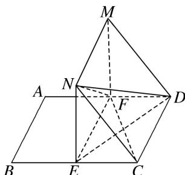

> [!faq]- 《专题10 立体几何中的面积与体积问题-立体几何（文科）》例题解析
>
> > [!success]- **【答案】** 详见解析
>
> > [!note]- **【解析】**
> > 解析
> > (1)∵四边形 MNEF 和四边形 EFDC 都是矩形,
> >
> > ∴MN//EF, EF//CD, MN=EF=CD, ∴MN∥CD.
> >
> > ∴四边形 MNCD 是平行四边形，∴NC∥MD.
> >
> > ∵NC∉平面 MFD, MD⊂平面 MFD, ∴NC∥平面 MFD.
> >
> > 
> >
> > (2)连接 ED，∵平面 MNEF⊥平面 ECDF，且 $NE \perp EF$ ，
> >
> > 平面 $MNEF \cap$ 平面 ECDF = EF，NE ⊂ 平面 MNEF，∴ NE ⊥ 平面 ECDF.
> >
> > ∵FC⊂平面ECDF，∴FC⊥NE.
> >
> > ∵EC=CD，∴四边形ECDF为正方形，∴FC⊥ED.
> >
> > 又∵ED∩NE=E，ED，NE⊂平面 NED，∴FC⊥平面 NED.
> >
> > ∵ ND⊂平面 NED，∴ ND⊥FC.
> >
> > (3)设 NE=x，则 FD=EC=4-x，其中 0<x<4，由
> > (2)得 $NE \perp$ 平面 FEC，
> >
> > ∴四面体 NEFD 的体积为 $V_{NEFD}=\frac{1}{3}S_{\triangle EFD}\cdot NE=\frac{1}{2}x(4-x)$ . $\therefore V_{四面体 NEFD}\leq\frac{1}{2}\left[\frac{x+(4-x)}{2}\right]^{2}=2$ ,
> >
> > 当且仅当 x=4-x，即 x=2 时，四面体 NEFD 的体积最大，最大值为 2.
