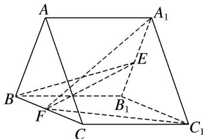

<!-- question-source:start -->
4. 如图，三棱柱 $ABC - A_{1}B_{1}C_{1}$ 的各棱长均为 2， $AA_{1} \perp$ 平面 $ABC$ ， $E$ ， $F$ 分别为棱 $A_{1}B_{1}$ ， $BC$ 的中点.

①求证：直线 $BE \parallel$ 平面 $A_{1}FC_{1}$ ;

②平面 $A_{1}FC_{1}$ 与直线 AB 交于点 M，指出点 M 的位置，说明理由，并求三棱锥 B-EFM 的体积.

<!-- question-source:end -->

![[高中/总复习/专题/立体几何/专题10 立体几何中的面积与体积问题-立体几何（文科）/考点02_几何体的体积问题/对点训练/answers/Q00039778A1.md]]
