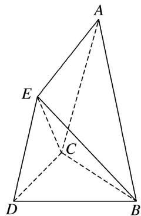

<!-- question-source:start -->
7. 已知空间几何体 $ABCDE$ 中， $\triangle BCD$ 与 $\triangle CDE$ 均为边长为 2 的等边三角形， $\triangle ABC$ 为腰长为 3 的等腰三角形，平面 $CDE \perp$ 平面 $BCD$ ，平面 $ABC \perp$ 平面 $BCD$ .

(1)试在平面 BCD 内作一条直线，使得直线上任意一点 F 与 E 的连线 EF 均与平面 ABC 平行，并给出详细证明；

(2)求三棱锥 E-ABC 的体积.

<!-- question-source:end -->

![[高中/总复习/专题/立体几何/专题10 立体几何中的面积与体积问题-立体几何（文科）/考点02_几何体的体积问题/对点训练/answers/Q00043695A1.md]]
