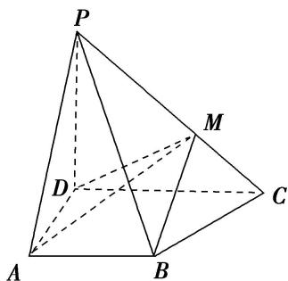

<!-- question-source:start -->
9. 如图, 在四棱锥 $P - ABCD$ 中, $PD \perp$ 底面 $ABCD$ , $AB \parallel CD$ , $AB = 2$ , $CD = 3$ , $M$ 为 $PC$ 上一点, 且 $PM = 2MC$ .

(1)求证： $BM / /$ 平面PAD；

(2)若 $AD = 2$ ， $PD = 3$ ， $\angle BAD = \frac{\pi}{3}$ ，求三棱锥 $P - ADM$ 的体积.

<!-- question-source:end -->

![[高中/总复习/专题/立体几何/专题10 立体几何中的面积与体积问题-立体几何（文科）/考点02_几何体的体积问题/对点训练/answers/Q00043697A1.md]]
