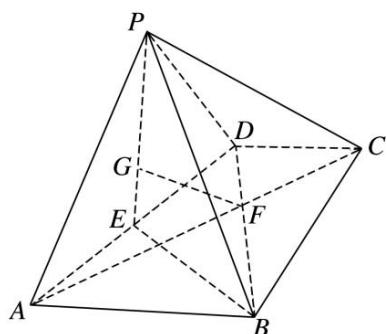

<!-- question-source:start -->
10. 如图，在四棱锥 $P - ABCD$ 中，平面 $PAD \perp$ 平面 $ABCD$ ，底面 $ABCD$ 为梯形， $AB \parallel CD$ ， $AB = 2DC = 2\sqrt{3}$ ，且 $\triangle PAD$ 与 $\triangle ABD$ 均为正三角形， $E$ 为 $AD$ 的中点， $G$ 为 $\triangle PAD$ 的重心.

(1)求证： $GF / /$ 平面PDC；

(2)求三棱锥 G—PCD 的体积.

<!-- question-source:end -->

![[高中/总复习/专题/立体几何/专题10 立体几何中的面积与体积问题-立体几何（文科）/考点02_几何体的体积问题/对点训练/answers/Q00043698A1.md]]
