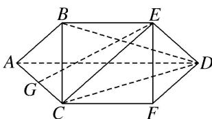

<!-- question-source:start -->
11. 如图所示的五面体 $ABEDFC$ 中, 四边形 $ACFD$ 是等腰梯形, $AD \parallel FC$ , $\angle DAC = 60^{\circ}$ , $BC \perp$ 平面 $ACFD$ , $CA = CB = CF = 1$ , $AD = 2CF$ , 点 $G$ 为 $AC$ 的中点.

(1)在 $AD$ 上是否存在一点 $H$ , 使 $GH \parallel$ 平面 $BCD$ ? 若存在, 指出点 $H$ 的位置并给出证明; 若不存在,说明理由;

(2)求三棱锥 G-ECD 的体积.

<!-- question-source:end -->

![[高中/总复习/专题/立体几何/专题10 立体几何中的面积与体积问题-立体几何（文科）/考点02_几何体的体积问题/对点训练/answers/Q00043699A1.md]]
