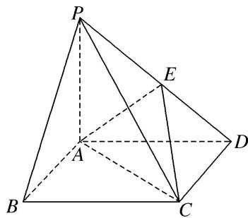

<!-- question-source:start -->
12. 如图，在四棱锥 P-ABCD 中，底面 ABCD 为菱形， $PA \perp$ 平面 ABCD，E 为 PD 的中点.

(1)证明： $PB / /$ 平面ACE；

(2)设 $PA = 1$ ， $AD = \sqrt{3}$ ， $PC = PD$ ，求三棱锥 $P - ACE$ 的体积.

<!-- question-source:end -->

![[高中/总复习/专题/立体几何/专题10 立体几何中的面积与体积问题-立体几何（文科）/考点02_几何体的体积问题/对点训练/answers/Q00043700A1.md]]
