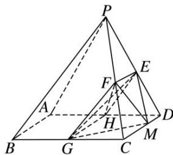

<!-- question-source:start -->
4. 如图, 已知在四棱锥 $P - ABCD$ 中, 底面 $ABCD$ 是边长为 4 的正方形, $\triangle PAD$ 是正三角形, 平面 $PAD$

⊥平面 ABCD, E, F, G 分别是 PD, PC, BC 的中点.

(1)求证：平面 $EFG \perp$ 平面 $PAD$ ;

(2)若 M 是线段 CD 上一点，求三棱锥 M—EFG 的体积.

<!-- question-source:end -->

![[高中/总复习/专题/立体几何/专题10 立体几何中的面积与体积问题-立体几何（文科）/考点02_几何体的体积问题/对点训练/answers/Q00043724A1.md]]
