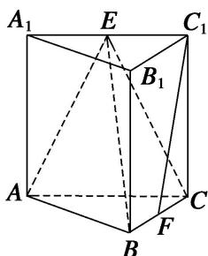

<!-- question-source:start -->
1. (2014·北京)如图，在三棱柱 $ABC - A_{1}B_{1}C_{1}$ 中，侧棱垂直于底面， $AB \perp BC$ ， $AA_{1} = AC = 2$ ， $BC = 1$ ， $E$ ， $F$ 分别是 $A_{1}C_{1}$ ， $BC$ 的中点.

(1)求证：平面 $ABE \perp$ 平面 $B_{1}BCC_{1}$ ;

(2)求证： $C_{1}F \parallel$ 平面 ABE;

(3)求三棱锥 E-ABC 的体积.

<!-- question-source:end -->

![[高中/总复习/专题/立体几何/专题10 立体几何中的面积与体积问题-立体几何（文科）/考点02_几何体的体积问题/对点训练/answers/Q00043729A1.md]]
