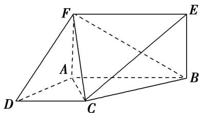

<!-- question-source:start -->
2. 如图，已知 $AF \perp$ 平面 $ABCD$ ，四边形 $ABEF$ 为矩形，四边形 $ABCD$ 为直角梯形， $\angle DAB = 90^\circ$ ， $AB // CD$ ， $AD = AF = CD = 2$ ， $AB = 4$ .

(1)求证： $AF \parallel$ 平面 BCE;

(2)求证： $AC \perp$ 平面 $BCE$ ;

(3)求三棱锥 E-BCF 的体积.

<!-- question-source:end -->

![[高中/总复习/专题/立体几何/专题10 立体几何中的面积与体积问题-立体几何（文科）/考点02_几何体的体积问题/对点训练/answers/Q00043730A1.md]]
