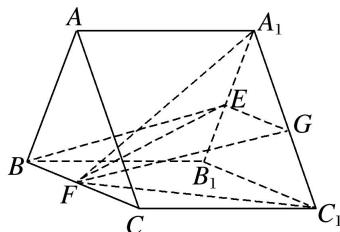
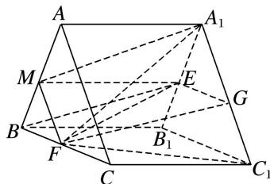

> [!faq]- 《专题10 立体几何中的面积与体积问题-立体几何（文科）》例题解析
>
> > [!success]- **【答案】** 详见解析
>
> > [!note]- **【分析】**
> > 本题未单列分析。
>
> > [!note]- **【解析】**
> > 解析 ①取 $A_{1}C_{1}$ 的中点 G，连接 EG，FG，
> > 
> > 因为点 E 为 $A_{1}B_{1}$ 的中点，所以 $EG \parallel B_{1}C_{1}$ 且 $EG = \frac{1}{2}B_{1}C_{1}$ ,
> > 因为 $F$ 为 $BC$ 的中点，所以 $BF \parallel B_{1}C_{1}$ 且 $BF = \frac{1}{2} B_{1}C_{1}$ ，所以 $BF \parallel EG$ 且 $BF = EG$ .
> > 所以四边形 BFGE 是平行四边形，所以 $BE \parallel FG$ ，又 $BE \nmid$ 平面 $A_{1}FC_{1}$ ， $FG \subset$ 平面 $A_{1}FC_{1}$ ，
> > 所以直线 $BE \parallel$ 平面 $A_{1}FC_{1}$ .
> > - **②**：M 为棱 AB 的中点.
> > 
> > 理由如下:
> > 因为 $AC \parallel A_{1}C_{1}$ ， $AC \nmid$ 平面 $A_{1}FC_{1}$ ， $A_{1}C_{1} \subset$ 平面 $A_{1}FC_{1}$ ，所以直线 $AC \parallel$ 平面 $A_{1}FC_{1}$ ，
> > 又平面 $A_{1}FC_{1} \cap$ 平面 ABC = FM，所以 $AC \parallel FM$ 。又 F 为棱 BC 的中点，所以 M 为棱 AB 的中点。 $S_{\triangle BFM}=\frac{1}{4}S_{\triangle ABC}=\frac{1}{4}\times\frac{1}{2}\times2\times2\times\sin60^{\circ}=\frac{\sqrt{3}}{4}$
> > 所以三棱锥 B-EFM 的体积 $V_{B-EFM}=V_{E-BFM}=\frac{1}{3}\times\frac{\sqrt{3}}{4}\times2=\frac{\sqrt{3}}{6}$ .
