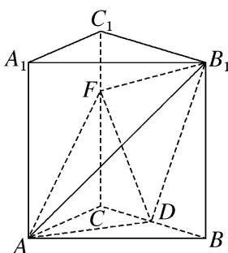

> [!faq]- 《专题10 立体几何中的面积与体积问题-立体几何（文科）》例题解析
>
> > [!success]- **【答案】** 详见解析
>
> > [!note]- **【分析】**
> > 本题未单列分析。
>
> > [!note]- **【解析】**
> > (1)当 $CF = 2$ 时，证明： $B_{1}F\bot$ 平面 $ADF;$
> > (2)若 $FD \perp B_{1}D$ ，求三棱锥 $B_{1}-ADF$ 的体积.
> > 
> > 1. 解析 (1) 因为 AB = AC，D 是 BC 的中点，所以 $AD \perp BC$ .
> > 在直三棱柱 $ABC-A_{1}B_{1}C_{1}$ 中，因为 $BB_{1}\perp$ 底面 ABC， $AD\subset$ 底面 ABC，所以 $AD\perp B_{1}B$ .
> > 因为 $BC \cap B_{1}B = B$ ，所以 $AD \perp$ 平面 $B_{1}BCC_{1}$ 。因为 $B_{1}F \subset$ 平面 $B_{1}BCC_{1}$ ，所以 $AD \perp B_{1}F$ 。
> > 在矩形 $B_{1}BCC_{1}$ 中，因为 $C_1F = CD = 1$ ， $B_{1}C_{1} = CF = 2$ ，所以 $\mathrm{Rt}\triangle DCF\cong \mathrm{Rt}\triangle FC_1B_1$
> > 所以 $\angle CFD = \angle C_{1}B_{1}F$ ，所以 $\angle B_{1}FD = 90^{\circ}$ ，所以 $B_{1}F \perp FD$ .
> > 因为 $AD \cap FD = D$ ，所以 $B_{1}F \perp$ 平面 ADF.
> > (2)由(1)知 $AD \perp$ 平面 $B_{1}DF$ , $CD = 1$ , $AD = 2\sqrt{2}$ ,
> > 在 Rt△B₁BD 中，BD=CD=1，BB₁=3，所以 B₁D= $\sqrt{BD^{2}+BB_{1}^{2}}=\sqrt{10}$ .
> > 因为 $FD \perp B_{1}D$ ，所以 $Rt\triangle CDF \sim Rt\triangle BB_{1}D$ ，所以 $\frac{DF}{B_{1}D} = \frac{CD}{BB_{1}}$ ，即 $DF = \frac{1}{3} \times \sqrt{10} = \frac{\sqrt{10}}{3}$ ,
> > 所以 $V_{B_{1}-ADF}=V_{A-B_{1}DF}=\frac{1}{3}S_{\triangle B_{1}DF}\times AD=\frac{1}{3}\times\frac{1}{2}\times\frac{\sqrt{10}}{3}\times\sqrt{10}\times2\sqrt{2}=\frac{10\sqrt{2}}{9}.$
