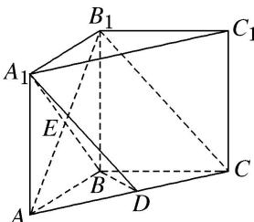
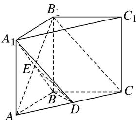

> [!faq]- 《专题10 立体几何中的面积与体积问题-立体几何（文科）》例题解析
>
> > [!success]- **【答案】** 详见解析
>
> > [!note]- **【分析】**
> > 本题未单列分析。
>
> > [!note]- **【解析】**
> > (1)求证： $BD \perp$ 平面 $A_{1}ACC_{1}$ ;
> > (2)若 AB=1，且 $AC\cdot AD=1$ ，求三棱锥 $A-BCB_{1}$ 的体积.
> > 
> > 2. 解析 (1)如图，连接 $ED$ ， $\because$ 平面 $AB_{1}C \cap$ 平面 $A_{1}BD = ED$ ， $B_{1}C //$ 平面 $A_{1}BD$ ， $\therefore B_{1}C // ED$
> > ∵E为 $AB_{1}$ 的中点，∴D为AC的中点，∵AB=BC，∴ $BD\perp AC$ .
> > $\because A_{1}A\perp$ 平面 ABC, BD⊂平面 ABC, $\therefore A_{1}A\perp BD.$
> > 又∵ $A_{1}A$ ，AC 是平面 $A_{1}ACC_{1}$ 内的两条相交直线，∴ $BD \perp$ 平面 $A_{1}ACC_{1}$ .
> > 
> > (2)由 AB=1，得 $BC=BB_{1}=1$ ，由(1)知 $AD=\frac{1}{2}AC$ ，又 $AC\cdot AD=1$ ，∴ $AC^{2}=2$ ，
> > $$
> > \therefore A C ^ {2} = 2 = A B ^ {2} + B C ^ {2}, \quad \therefore A B \perp B C, \quad \therefore S _ {\triangle A B C} = \frac {1}{2} A B \cdot B C = \frac {1}{2},
> > $$
> > $\therefore V_{A - BCB_1} = V_{B_1 - ABC} = \frac{1}{3} S_{\triangle ABC} \cdot BB_1 = \frac{1}{3} \times \frac{1}{2} \times 1 = \frac{1}{6}$ .
