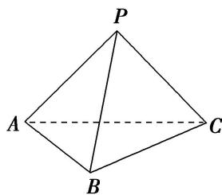
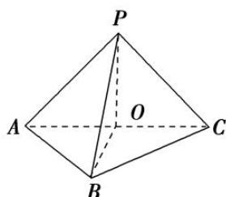

> [!faq]- 《专题10 立体几何中的面积与体积问题-立体几何（文科）》例题解析
>
> > [!success]- **【答案】** (1)求证：平面 PAC⊥平面 ABC; (2)若 $PA = PC$ ，求三棱锥 $P - ABC$ 的体积. 1.
>
> > [!note]- **【分析】**
> > 本题未单列分析。
>
> > [!note]- **【解析】**
> > 
> > (1)证明：如图，取 $AC$ 的中点 $O$ ，连接 $BO$ ， $PO$ .
> > 因为 $\triangle ABC$ 是边长为2的正三角形，所以 $BO\perp AC,\ BO=\sqrt{3}$ .
> > 因为 $PA \perp PC$ ，所以 $PO = \frac{1}{2} AC = 1$ 。因为 $PB = 2$ ，所以 $OP^2 + OB^2 = PB^2$ ，所以 $PO \perp OB$ .
> > 因为 $AC \cap OP = O$ ，所以 $BO \perp$ 平面 PAC。又 OB⊂ 平面 ABC，
> > 所以平面 PAC⊥平面 ABC.
> > 
> > (2)因为 $PA = PC$ ， $PA\bot PC$ ， $AC = 2$ ，所以 $PA = PC = \sqrt{2}$ .由(1)知 $BO\bot$ 平面 $PAC$
> > 所以 $V_{P-ABC}=\frac{1}{3}S_{\triangle PAC}\cdot BO=\frac{1}{3}\times\frac{1}{2}\times\sqrt{2}\times\sqrt{2}\times\sqrt{3}=\frac{\sqrt{3}}{3}.$
