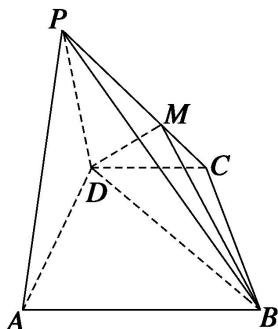
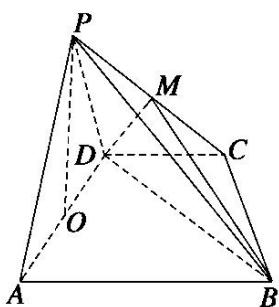

> [!faq]- 《专题10 立体几何中的面积与体积问题-立体几何（文科）》例题解析
>
> > [!success]- **【答案】** 详见解析
>
> > [!note]- **【分析】**
> > 本题未单列分析。
>
> > [!note]- **【解析】**
> > (1)设 $M$ 是 $PC$ 上的一点，求证：平面 $MBD \perp$ 平面 $PAD$ ;
> > (2)求四棱锥 P—ABCD 的体积.
> > 
> > 3. 解析 (1) 在 $\triangle ABD$ 中， $\because AD = 4, BD = 8, AB = 4\sqrt{5}, \therefore AD^2 + BD^2 = AB^2 \therefore AD \perp BD$ . 又 $\because$ 平面 $PAD \perp$ 平面 $ABCD$ ，平面 $PAD \cap$ 平面 $ABCD = AD, BD \subset$ 平面 $ABCD, \therefore BD \perp$ 平面 $PAD$ . 又 $BD \subset$ 平面 $MBD, \therefore$ 平面 $MBD \perp$ 平面 $PAD$ .
> > 
> > (2)过 $P$ 作 $PO \perp AD$ , $\because$ 平面 $PAD \perp$ 平面 $ABCD$ , $\therefore PO \perp$ 平面 $ABCD$ , 即 $PO$ 为四棱锥 $P-ABCD$ 的高. 又 $\triangle PAD$ 是边长为 4 的等边三角形, $\therefore PO = 2\sqrt{3}$ . 在底面四边形 $ABCD$ 中, $AB // DC$ , $AB = 2DC$ , $\therefore$ 四边形 $ABCD$ 为梯形. 在 Rt $\triangle ADB$ 中, 斜边 $AB$ 边上的高为 $\frac{4 \times 8}{4\sqrt{5}} = \frac{8\sqrt{5}}{5}$ , 此即为梯形的高. $\therefore S_{\text{四边形 }ABCD} = \frac{2\sqrt{5} + 4\sqrt{5}}{2} \times \frac{8\sqrt{5}}{5} = 24$ . $\therefore V_{P-ABCD} = \frac{1}{3} \times 24 \times 2\sqrt{3} = 16\sqrt{3}$ .
