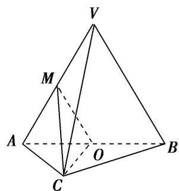

> [!faq]- 《专题10 立体几何中的面积与体积问题-立体几何（文科）》例题解析
>
> > [!success]- **【答案】** 详见解析
>
> > [!note]- **【分析】**
> > 本题未单列分析。
>
> > [!note]- **【解析】**
> > (1)求证： $VB \parallel$ 平面 MOC;
> > (2)求证：平面 $MOC \perp$ 平面 VAB;
> > (3)求三棱锥 V-ABC 的体积.
> > 3. 解析 (1) 因为 $O$ , $M$ 分别为 $AB$ , $VA$ 的中点, 所以 $OM \parallel VB$ .
> > 又因为 $VB \not\subset$ 平面 MOC，所以 $VB \parallel$ 平面 MOC.
> > 
> > (2)因为 $AC = BC$ ， $O$ 为 $AB$ 的中点，所以 $OC \perp AB$ .
> > 又因为平面 $VAB \perp$ 平面 ABC，且 $OC \subset$ 平面 ABC，所以 $OC \perp$ 平面 VAB.
> > 所以平面 $MOC \perp$ 平面 VAB.
> > (3)在等腰直角三角形 ACB 中， $AC=BC=\sqrt{2}$ ，所以 AB=2，OC=1。
> > 所以等边三角形 VAB 的面积 $S_{\triangle VAB}=\sqrt{3}$ . 又因为 OC⊥平面 VAB,
> > 所以三棱锥 C-VAB 的体积等于 $\frac{1}{3}OC \cdot S_{\triangle VAB} = \frac{\sqrt{3}}{3}$ .
> > 又因为三棱锥 $V - ABC$ 的体积与三棱锥 $C - VAB$ 的体积相等，所以三棱锥 $V - ABC$ 的体积为 $\frac{\sqrt{3}}{3}$ .
