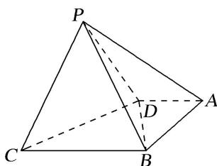
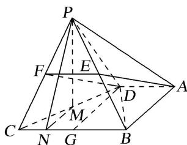

> [!faq]- 《专题10 立体几何中的面积与体积问题-立体几何（文科）》例题解析
>
> > [!success]- **【答案】** 详见解析
>
> > [!note]- **【分析】**
> > 本题未单列分析。
>
> > [!note]- **【解析】**
> > (1)在棱 $PB$ 上是否存在点 $E$ , 使得 $AE \parallel$ 平面 $PDC$ ? 若存在, 试确定点 $E$ 的位置; 若不存在, 试说明理由;
> > (2)若 $\triangle PBC$ 的面积为 $\frac{\sqrt{15}}{2}$ ，求四棱锥 $P - ABCD$ 的体积.
> > 
> > 1. 解析
> > (1)存在．当点 E 为棱 PB 的中点，使得 AE // 平面 PDC．理由如下：
> > 如图所示，取 $PB$ 的中点 $E$ ，连接 $AE$ ，取 $PC$ 的中点 $F$ ，连接 $EF$ ， $DF$ ，取 $BC$ 的中点 $G$ ，连接 $DG$
> > 
> > 因为 $\triangle BCD$ 是等边三角形，所以 $\angle DGB=90^{\circ}$ .
> > 因为 $\angle ABC = \angle BAD = 90^{\circ}$ ，所以四边形 ABGD 为矩形，所以 $AD = BG = \frac{1}{2} BC, AD \parallel BC.$
> > 因为 EF 为 $\triangle BCP$ 的中位线，所以 $EF = \frac{1}{2} BC$ ，且 $EF \parallel BC$ ，故 AD = EF，且 $AD \parallel EF$ ，所以四边形 ADFE 是平行四边形，从而 $AE \parallel DF$ ，
> > 又 $AE \notin$ 平面 $PDC$ , $DF \subset$ 平面 $PDC$ , 所以 $AE \parallel$ 平面 $PDC$ .
> > (2)取 $CD$ 的中点 $M$ , 连接 $PM$ , 过点 $P$ 作 $PN \perp BC$ 交 $BC$ 于点 $N$ , 连接 $MN$ , 如图所示. 因为 $\triangle PDC$ 为等边三角形, 所以 $PM \perp DC$ .
> > 因为 $PM \perp DC$ ，平面 $PDC \perp$ 平面 BDC，平面 $PDC \cap$ 平面 BDC = DC， $PM \subset$ 平面 PDC，
> > 所以 $PM \perp$ 平面 BCD，则 PM 为四棱锥 P-ABCD 的高.
> > 又 $BC \subset$ 平面 BCD，所以 $PM \perp BC$ .
> > 因为 $PN \perp BC$ ， $PN \cap PM = P$ ， $PN \subset$ 平面 PMN， $PM \subset$ 平面 PMN，所以 $BC \perp$ 平面 PMN.
> > 因为 $MN \subset$ 平面 PMN，所以 $MN \perp BC$ 。由 M 为 DC 的中点，易知 $NC = \frac{1}{4} BC$ 。
> > 设 $BC = x$ ，则 $\triangle PBC$ 的面积为 $\frac{x}{2}\sqrt{x^2 - \left(\frac{x}{4}\right)^2} = \frac{\sqrt{15}}{2}$ ，解得 $x = 2$ ，即 $BC = 2$
> > $$
> > A D = 1, A B = D G = P M = \sqrt {3}
> > $$
> > 故四棱锥 P-ABCD 的体积为 $V=\frac{1}{3}\times S_{梯形ABCD}\times PM=\frac{1}{3}\times\frac{(1+2)\times\sqrt{3}}{2}\times\sqrt{3}=\frac{3}{2}$ .
