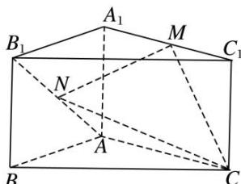
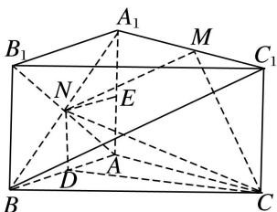

> [!faq]- 《专题10 立体几何中的面积与体积问题-立体几何（文科）》例题解析
>
> > [!success]- **【答案】** 详见解析
>
> > [!note]- **【分析】**
> > 本题未单列分析。
>
> > [!note]- **【解析】**
> > (1)证明： $MN \parallel$ 平面 $BB_{1}C_{1}C$ ;
> > (2)若 $CM \perp MN$ ，求三棱锥 M—NAC 的体积.
> > 
> > 2. 解析
> > (1)连接 $A_{1}B, BC_{1}$ , 点 $M, N$ 分别为 $A_{1}C_{1}, AB_{1}$ 的中点,
> > 所以 MN 为 $\triangle A_{1}BC_{1}$ 的一条中位线， $MN \parallel BC_{1}$ ，
> > 又因为 $MN \not\subset$ 平面 $BB_{1}C_{1}C$ ， $BC_{1} \subset$ 平面 $BB_{1}C_{1}C$ ，所以 $MN \parallel$ 平面 $BB_{1}C_{1}C$ .
> > 
> > (2)设点 D, E 分别为 AB, $AA_{1}$ 的中点, $AA_{1}=a$ , 连接 ND, CD, 则 $CM^{2}=a^{2}+1$ , $MN^{2}=1+\frac{a^{2}+4}{4}=\frac{a^{2}+8}{4}$ , $CN^{2}=\frac{a^{2}}{4}+5=\frac{a^{2}+20}{4}$ , 由 $CM\perp MN$ , 得 $CM^{2}+MN^{2}=CN^{2}$ , 解得 $a=\sqrt{2}$ , 又 $NE\perp$ 平面 $AA_{1}C_{1}C$ , NE=1, $V_{三棱锥 M-NAC}=V_{三棱锥 N-AMC}=\frac{1}{3}S_{\triangle AMC}\cdot NE=\frac{1}{3}\times\frac{1}{2}\times2\times\sqrt{2}\times1=\frac{\sqrt{2}}{3}$ .
> > 所以三棱锥 M—NAC 的体积为 $\frac{\sqrt{2}}{3}$ .
