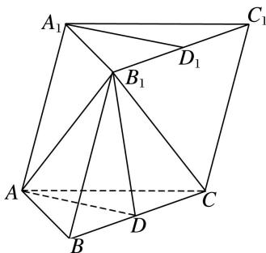
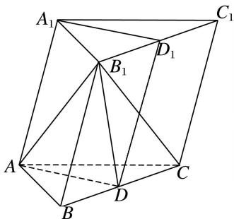

> [!faq]- 《专题10 立体几何中的面积与体积问题-立体几何（文科）》例题解析
>
> > [!success]- **【答案】** AD
>
> > [!note]- **【分析】**
> > 本题未单列分析。
>
> > [!note]- **【解析】**
> > (1)求证： $A_{1}D_{1} \parallel$ 平面 $AB_{1}D;$
> > (2)若平面 $ABC \perp$ 平面 $BCC_{1}B_{1}$ ， $\angle B_{1}BC = 60^{\circ}$ ，求三棱锥 $B_{1} - ABC$ 的体积.
> > 
> > 3. 解析
> > (1) 连接 $DD_{1}$ ，在三棱柱 $ABC-A_{1}B_{1}C_{1}$ 中，
> > 
> > ∵D， $D_{1}$ 分别是 BC 和 $B_{1}C_{1}$ 的中点，∴ $B_{1}D_{1} \parallel BD$ ，且 $B_{1}D_{1} = BD$ ，∴四边形 $B_{1}BDD_{1}$ 为平行四边形，
> > ∴ $BB_{1}//DD_{1}$ ，且 $BB_{1}=DD_{1}$ 。又∵ $AA_{1}//BB_{1}$ ， $AA_{1}=BB_{1}$ ，∴ $AA_{1}//DD_{1}$ ， $AA_{1}=DD_{1}$ ，
> > ∴四边形 $AA_{1}D_{1}D$ 为平行四边形，∴ $A_{1}D_{1} // AD$ .
> > 又∵ $A_{1}D_{1}\not\subset$ 平面 $AB_{1}D$ ， $AD\subset$ 平面 $AB_{1}D$ ，∴ $A_{1}D_{1}//$ 平面 $AB_{1}D$ .
> > (2)在 $\triangle ABC$ 中，边长均为4，则 $AB=AC$ ， $D$ 为 $BC$ 的中点， $\therefore AD\perp BC$ .
> > ∵平面 $ABC \perp$ 平面 $B_{1}C_{1}CB$ ，平面 $ABC \cap$ 平面 $B_{1}C_{1}CB = BC$ ， $AD \subset$ 平面 ABC，
> > ∴ $AD \perp$ 平面 $B_{1}C_{1}CB$ ，即 AD 是三棱锥 $A - B_{1}BC$ 的高.
> > 在 $\triangle ABC$ 中，由 $AB=AC=BC=4$ ，得 $AD=2\sqrt{3}$ ，在 $\triangle B_{1}BC$ 中， $B_{1}B=BC=4$ ， $\angle B_{1}BC=60^{\circ}$ ，
> > ∴ $\triangle B_{1}BC$ 的面积为 $4\sqrt{3}$ . ∴ 三棱锥 $B_{1}-ABC$ 的体积即为三棱锥 $A-B_{1}BC$ 的体积 $V=\frac{1}{3}\times4\sqrt{3}\times2\sqrt{3}=8$ .
