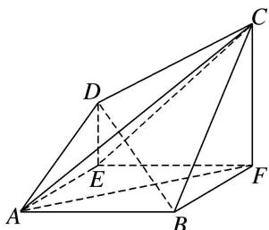
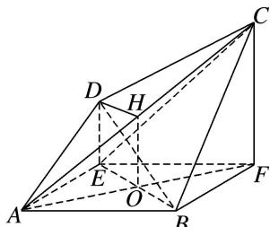

> [!faq]- 《专题10 立体几何中的面积与体积问题-立体几何（文科）》例题解析
>
> > [!success]- **【答案】** BE
>
> > [!note]- **【分析】**
> > 本题未单列分析。
>
> > [!note]- **【解析】**
> > (1)证明： $BE \parallel$ 平面 ACD;
> > (2)求三棱锥 E-ACD 的体积.
> > 
> > 
> > 图1
> > 图2
> > 5. 解析
> > (1)连接 BE 交 AF 于点 O，取 AC 的中点 H，连接 OH，DH，则 OH 是 $\triangle AFC$ 的中位线，
> > 
> > 所以 $OH \parallel CF$ 且 $OH = \frac{1}{2}CF$ ，由已知得 $DE \parallel CF$ 且 $DE = \frac{1}{2}CF$ ，所以 $DE \parallel OH$ 且 DE = OH，
> > 所以四边形 DEOH 为平行四边形，DH//EO，又因为 EO⊥平面 ACD，DH⊂平面 ACD，
> > 所以 EO// 平面 ACD，即 BE// 平面 ACD.
> > (2)由已知得，四边形 ABFE 为正方形，且边长为 2，则 $AF \perp BE$ ，
> > 由已知 $AF \perp BD$ ， $BE \cap BD = B$ ，BE， $BD \subset$ 平面 BDE，可得 $AF \perp$ 平面 BDE，
> > 又 $DE \subset$ 平面 BDE，所以 $AF \perp DE$ ，又 $AE \perp DE$ ， $AF \cap AE = A$ ，AF， $AE \subset$ 平面 ABFE，
> > $$
> > D E \perp
> > $$
> > $$
> > D E \perp E F,
> > $$
> > 又 $AE \perp EF$ ， $DE \cap EF = E$ ，DE， $EF \subset$ 平面 CDE，所以 $AE \perp$ 平面 CDE，
> > 所以 AE 是三棱锥 A-DEC 的高， $V_{E-ACD}=V_{A-ECD}=V_{A-EFD}=\frac{1}{3}\times AE\times\frac{1}{2}\times DE\times EF=\frac{2}{3}$
