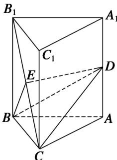
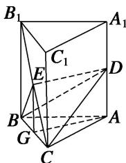

> [!faq]- 《专题10 立体几何中的面积与体积问题-立体几何（文科）》例题解析
>
> > [!success]- **【答案】** 详见解析
>
> > [!note]- **【分析】**
> > 本题未单列分析。
>
> > [!note]- **【解析】**
> > (1)求证： $DE \parallel$ 平面 ABC;
> >
> > (2)求三棱锥 E-BCD 的体积.
> >
> > 6. 解析
> > (1)取 $BC$ 中点 $G$ , 连接 $AG$ , $EG$ . 因为 $E$ 是 $B_{1}C$ 的中点, 所以 $EG \parallel BB_{1}$ , 且 $EG = \frac{1}{2} BB_{1}$ .
> >
> > 
> >
> > 由直棱柱知， $AA_{1} \parallel BB_{1}$ ，而 D 是 $AA_{1}$ 的中点，所以 $EG \parallel AD$ ，
> >
> > 所以四边形 EGAD 是平行四边形．所以 $ED \parallel AG$ ．又 $DE \not\subset$ 平面 ABC， $AG \subset$ 平面 ABC，所以 DE // 平面 ABC.
> >
> > 
> >
> > (2)因为 $AD \parallel EG$ ， $EG \subset$ 平面 BCE， $AD \not\subset$ 平面 BCE，所以 $AD \parallel$ 平面 BCE，
> >
> > 所以 $V_{E-BCD}=V_{D-BEC}=V_{A-BCE}=V_{E-ABC}$ ，由
> > (1)知，DE//平面 ABC.
> >
> > 所以 $V_{E-ABC}=V_{D-ABC}=\frac{1}{3}AD\cdot\frac{1}{2}BC\cdot AG=\frac{1}{6}\times3\times6\times4=12.$
