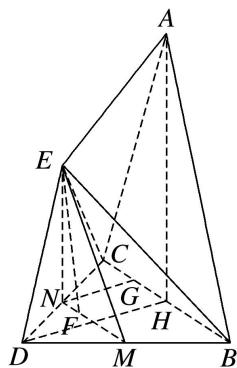

> [!faq]- 《专题10 立体几何中的面积与体积问题-立体几何（文科）》例题解析
>
> > [!success]- **【答案】** 详见解析
>
> > [!note]- **【解析】**
> > 解析
> > (1)如图所示, 取 $DC$ 的中点 $N$ , 取 $BD$ 的中点 $M$ , 连接 $MN$ , 则 $MN$ 即为所求直线.
> >
> > 
> >
> > 证明如下：
> >
> > 取 BC 的中点 H，连接 AH，∵ $\triangle ABC$ 是腰长为 3 的等腰三角形，H 为 BC 的中点，∴ $AH \perp BC$ ，
> >
> > 又平面 $ABC \perp$ 平面 BCD，平面 $ABC \cap$ 平面 BCD = BC， $AH \subset$ 平面 ABC，∴ $AH \perp$ 平面 BCD，
> >
> > 同理，可证 $EN \perp$ 平面 BCD，∴ $EN \parallel AH$ ，
> >
> > ∵EN∉平面ABC，AH⊂平面ABC，∴EN∥平面ABC.
> >
> > 又 M, N 分别为 BD, DC 的中点，∴ $MN \parallel BC$ ，∵ $MN \not\subset$ 平面 ABC, $BC \subset$ 平面 ABC，∴ $MN \parallel$ 平面 ABC.
> > 又 $MN \cap EN = N$ , $MN \subset$ 平面 EMN, $EN \subset$ 平面 EMN, ∴ 平面 EMN // 平面 ABC,
> >
> > 又 $EF \subset$ 平面 EMN, $\therefore EF \parallel$ 平面 ABC.
> >
> > (2)连接 DH，取 CH 的中点 G，连接 NG，则 $NG \parallel DH$ ， $NG = \frac{1}{2}DH$ ，由
> > (1)可知 EN // 平面 ABC，
> >
> > 所以点 E 到平面 ABC 的距离与点 N 到平面 ABC 的距离相等.
> >
> > 又 $\triangle BCD$ 是边长为2的等边三角形， $\therefore DH \perp BC, DH = \sqrt{3}$ ,
> >
> > 又平面 $ABC \perp$ 平面 BCD，平面 $ABC \cap$ 平面 BCD = BC，DH ⊂ 平面 BCD，
> >
> > ∴DH⊥平面ABC，∴NG⊥平面ABC，NG= $\frac{\sqrt{3}}{2}$ ,
> >
> > 又 $AC = AB = 3$ ， $BC = 2$ ， $\therefore S_{\triangle ABC} = \frac{1}{2}\cdot BC\cdot AH = 2\sqrt{2}.$ $\therefore V_{E - ABC} = V_{N - ABC} = \frac{1}{3}\cdot S_{\triangle ABC}\cdot NG = \frac{\sqrt{6}}{3}.$
