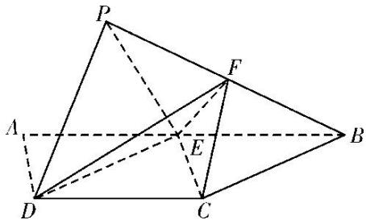

> [!faq]- 《专题10 立体几何中的面积与体积问题-立体几何（文科）》例题解析
>
> > [!success]- **【答案】** 详见解析
>
> > [!note]- **【分析】**
> > 本题未单列分析。
>
> > [!note]- **【解析】**
> > (1)求证： $PD \parallel$ 平面 CEF;
> > (2)求三棱锥 P-DEF 的体积.
> > 
> > 8. 解析
> > (1)因为点 $E$ 为 $AB$ 的中点, $AB \parallel CD$ , $AB = 2CD$ , 所以 $BE = CD$ 且 $BE \parallel CD$ , 所以四边形 $BCDE$ 是平行四边形。连接 $BD$ 交 $CE$ 于点 $O$ , 则点 $O$ 为 $BD$ 的中点, 连接 $FO$ , 因为点 $F$ 为 $PB$ 的中点, 所以 $PD \parallel FO$ , 又 $PD \nparallel$ 平面 $CEF$ , $FO \subset$ 平面 $CEF$ , 所以 $PD \parallel$ 平面 $CEF$ .
> > (2)由
> > (1)可知 $PD \parallel FO$ , $FO \nparallel$ 平面 $PDE$ , 所以 $FO \parallel$ 平面 $PDE$ , 所以点 $F$ 到平面 $PDE$ 的距离与点 $O$ 到平面 $PDE$ 的距离相等。连接 $OP$ , 则 $V_{P-DEF} = V_{F-PDE} = V_{O-PDE} = V_{P-ODE}$ 。由题意及四边形 $BCDE$ 是平行四边形得 $BC = CD = PD = PE = BE = DE = 2$ , 取 $DE$ 的中点 $H$ , 连接 $PH$ , 则 $PH \perp DE$ , 且 $PH = \sqrt{3}$ 。因为平面 $PDE \perp$ 平面 $BCDE$ , 平面 $PDE \cap$ 平面 $BCDE = DE$ , $PH \subset$ 平面 $PDE$ , 所以 $PH \perp$ 平面 $BCDE$ . 由题意得四边形 $ABCD$ 为等腰梯形且 $\angle ABC = 60^\circ$ , 又四边形 $BCDE$ 为菱形, 所以 $\angle EDC = 60^\circ$ , 所以 $S_{\triangle ODE} = \frac{1}{2} S_{\triangle DEC} = \frac{1}{2} \times \frac{1}{2} \times 2 \times 2 \times \sin 60^\circ = \frac{\sqrt{3}}{2}$ , 所以 $V_{P-DEF} = V_{P-ODE} = \frac{1}{3} S_{\triangle ODE} \times PH = \frac{1}{3} \times \frac{\sqrt{3}}{2} \times \sqrt{3} = \frac{1}{2}$ .
