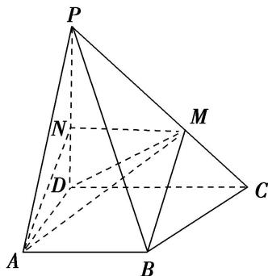
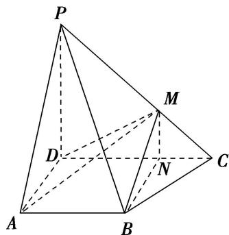
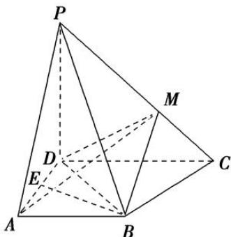

> [!faq]- 《专题10 立体几何中的面积与体积问题-立体几何（文科）》例题解析
>
> > [!success]- **【答案】** 详见解析
>
> > [!note]- **【解析】**
> > 解析：(1)证明：法一：如图，过 M 作 $MN \parallel CD$ 交 PD 于点 N，连接 AN.
> >
> > 
> >
> > $\because PM = 2MC, \therefore MN = \frac{2}{3} CD.$ 又 $AB = \frac{2}{3} CD$ ，且 $AB \parallel CD, \therefore AB \parallel MN, \therefore$ 四边形 $ABMN$ 为平行四边形， $\therefore BM \parallel AN.$ 又 $BM \notin$ 平面 $PAD, AN \subset$ 平面 $PAD, \therefore BM \parallel$ 平面 $PAD.$
> >
> > 法二：如图，过点 M 作 $MN \perp CD$ 于点 N，N 为垂足，连接 BN．由题意，PM = 2MC，则 DN = 2NC，
> >
> > 
> >
> > 又 $AB \parallel CD$ ， $AB = \frac{2}{3}CD$ ，∴ $AB \parallel DN$ ，∴ 四边形 ABND 为平行四边形，∴ $BN \parallel AD$ .
> >
> > ∵PD⊥平面ABCD，DC⊂平面ABCD，∴PD⊥DC.
> >
> > 又 $MN \perp DC$ ， $MN \subset$ 平面 $PDC$ ， $\therefore PD \parallel MN$ 。 $\because BN \subset$ 平面 $MBN$ ， $MN \subset$ 平面 $MBN$ ， $BN \cap MN = N$ ， $AD \subset$ 平面 $PAD$ ， $PD \subset$ 平面 $PAD$ ， $AD \cap PD = D$ ， $\therefore$ 平面 $MBN \parallel$ 平面 $PAD$ 。
> >
> > ∵BM⊂平面 MBN，∴BM∥平面 PAD.
> >
> > 
> >
> > (2)如图，过 $B$ 作 $AD$ 的垂线，垂足为 $E$ 。∵ $PD \perp$ 平面 $ABCD$ ， $BE \subset$ 平面 $ABCD$ ，∴ $PD \perp BE$ 。又 $AD \subset$ 平面 $PAD$ ， $PD \subset$ 平面 $PAD$ ， $AD \cap PD = D$ ，∴ $BE \perp$ 平面 $PAD$ 。由
> > (1)知， $BM //$ 平面 $PAD$ ，∴ 点 $M$ 到平面 $PAD$ 的距离等于点 $B$ 到平面 $PAD$ 的距离，即 $BE$ 。
> >
> > 连接 BD，在△ABD 中， $AB = AD = 2$ ， $\angle BAD = \frac{\pi}{3}$ ， $\therefore BE = \sqrt{3}$ ，
> >
> > 则三棱锥 P-ADM 的体积 $V_{P-ADM}=V_{M-PAD}=\frac{1}{3}\times S_{\triangle PAD}\times BE=\frac{1}{3}\times3\times\sqrt{3}=\sqrt{3}$ .
