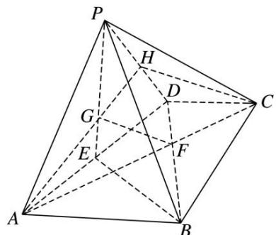
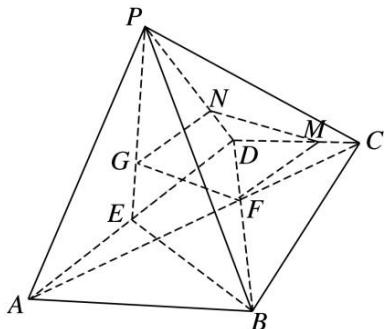
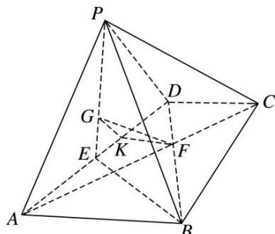

> [!faq]- 《专题10 立体几何中的面积与体积问题-立体几何（文科）》例题解析
>
> > [!success]- **【答案】** 详见解析
>
> > [!note]- **【解析】**
> > 解析
> > (1)方法一 连接 AG 并延长交 PD 于点 H，连接 CH.
> >
> > 
> >
> > 由梯形 ABCD 中 $AB \parallel CD$ 且 AB = 2DC 知， $\frac{AF}{FC} = \frac{2}{1}$ . 又 E 为 AD 的中点，G 为 $\triangle PAD$ 的重心， $\therefore \frac{AG}{GH} = \frac{2}{1}$ .
> > 在 $\triangle AHC$ 中， $\frac{AG}{GH}=\frac{AF}{FC}=\frac{2}{1}$ ，故GF//HC. 又HC⊂平面PCD，GF∉平面PCD，∴GF//平面PDC.
> > 方法二 过 G 作 GN//AD 交 PD 于 N，过 F 作 FM//AD 交 CD 于 M，连接 MN，
> >
> > 
> >
> > ∵ G 为 $\triangle PAD$ 的重心， $\frac{GN}{ED} = \frac{PG}{PE} = \frac{2}{3}$ ，∴ $GN = \frac{2}{3} ED = \frac{2\sqrt{3}}{3}$ .
> >
> > 又 ABCD 为梯形， $AB \parallel CD$ ， $\frac{CD}{AB} = \frac{1}{2}$ ， $\therefore \frac{CF}{AF} = \frac{1}{2}$ ， $\therefore \frac{MF}{AD} = \frac{1}{3}$ ， $\therefore MF = \frac{2\sqrt{3}}{3}$ ， $\therefore GN = FM$ .
> >
> > 又由所作 $GN \parallel AD$ ， $FM \parallel AD$ ，得 $GN \parallel FM$ ， $\therefore$ 四边形 $GNMF$ 为平行四边形.
> >
> > ∴GF//MN，又∵GF∉平面PCD，MN⊂平面PCD，∴GF//平面PDC.
> >
> > 方法三 过 G 作 GK//PD 交 AD 于 K，连接 KF，GK，
> >
> > 
> >
> > 由 $\triangle PAD$ 为正三角形，E为AD的中点，G为 $\triangle PAD$ 的重心，得 $DK=\frac{2}{3}DE,\therefore DK=\frac{1}{3}AD,$
> >
> > 又由梯形 ABCD 中 $AB \parallel CD$ ，且 AB = 2DC，知 $\frac{AF}{FC} = \frac{2}{1}$ ，即 $FC = \frac{1}{3} AC$ ，
> >
> > ∴在△ADC中， $KF \parallel CD$ ，又∵ $GK \cap KF = K$ ， $PD \cap CD = D$ ，∴平面 $GKF \parallel$ 平面PDC，
> >
> > 又 $GF \subset$ 平面 GKF，∴ $GF \parallel$ 平面 PDC.
> >
> > (2)方法一 由平面 $PAD \perp$ 平面 $ABCD$ ， $\triangle PAD$ 与 $\triangle ABD$ 均为正三角形， $E$ 为 $AD$ 的中点，知 $PE \perp AD$ ， $BE \perp AD$ ，又∵平面 $PAD \cap$ 平面 $ABCD = AD$ ， $PE \subset$ 平面 $PAD$ ，∴ $PE \perp$ 平面 $ABCD$ ，且 $PE = 3$ ，
> >
> > 由
> > (1)知 $GF \parallel$ 平面 PDC，∴ $V_{三棱锥 G—PCD}=V_{三棱锥 F—PCD}=V_{三棱锥 P—CDF}=\frac{1}{3}\times PE\times S_{\triangle CDF}.$
> >
> > 又由梯形 ABCD 中 $AB \parallel CD$ ，且 $AB = 2DC = 2\sqrt{3}$ ，知 $DF = \frac{1}{3}BD = \frac{2\sqrt{3}}{3}$ ,
> >
> > 又 $\triangle ABD$ 为正三角形，得 $\angle CDF=\angle ABD=60^{\circ}$ ， $\therefore S_{\triangle CDF}=\frac{1}{2}\times CD\times DF\times\sin\angle BDC=\frac{\sqrt{3}}{2}$ ，
> >
> > 得 $V_{三棱锥 P—CDF}=\frac{1}{3}\times PE\times S_{\triangle CDF}=\frac{\sqrt{3}}{2}, \therefore$ 三棱锥 G—PCD 的体积为 $\frac{\sqrt{3}}{2}$ .
> >
> > 方法二 由平面 $PAD \perp$ 平面 $ABCD$ , $\triangle PAD$ 与 $\triangle ABD$ 均为正三角形, $E$ 为 $AD$ 的中点, 知
> >
> > $PE \perp AD, BE \perp AD,$ 又∵平面 $PAD \cap$ 平面 $ABCD = AD, PE \subset$ 平面 $PAD, \therefore PE \perp$ 平面 $ABCD,$ 且 $PE = 3,$
> >
> > 连接 $CE$ ， $\because PG = \frac{2}{3} PE$ ， $\therefore V_{\text{三棱锥} G - PCD} = \frac{2}{3} V_{\text{三棱锥} E - PCD} = \frac{2}{3} V_{\text{三棱锥} P - CDE} = \frac{2}{3}\times \frac{1}{3}\times PE\times S_{\triangle CDE},$
> >
> > 又 $\triangle ABD$ 为正三角形，得 $\angle EDC=120^{\circ}$ ，得 $S_{\triangle CDE}=\frac{1}{2}\times CD\times DE\times\sin\angle EDC=\frac{3\sqrt{3}}{4}$ .
> >
> > ∴ $V_{三棱锥 G-PCD}=\frac{2}{3}\times\frac{1}{3}\times PE\times S_{\triangle CDE}=\frac{2}{3}\times\frac{1}{3}\times3\times\frac{3\sqrt{3}}{4}=\frac{\sqrt{3}}{2}$ ，∴三棱锥 G-PCD 的体积为 $\frac{\sqrt{3}}{2}$ .
