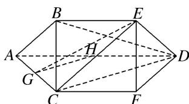

> [!faq]- 《专题10 立体几何中的面积与体积问题-立体几何（文科）》例题解析
>
> > [!success]- **【答案】** 详见解析
>
> > [!note]- **【解析】**
> > 解析
> > (1)存在点 $H$ 使 $GH \parallel$ 平面 $BCD$ , 此时 $H$ 为 $AD$ 的中点. 证明如下.
> >
> > 取点 H 为 AD 的中点，连接 GH，因为点 G 为 AC 的中点，
> >
> > 所以在 $\triangle ACD$ 中，由三角形中位线定理可知 GH//CD,
> >
> > 又 GH∉平面 BCD，CD⊂平面 BCD，所以 GH∥平面 BCD.
> >
> > 
> >
> > (2)因为 $AD \parallel CF$ ， $AD \subset$ 平面 ADEB， $CF \not\subset$ 平面 ADEB，所以 $CF \parallel$ 平面 ADEB，
> >
> > 因为 $CF \subset$ 平面 CFEB，平面 $CFEB \cap$ 平面 ADEB = BE，所以 $CF \parallel BE$ ，
> >
> > 又 $CF \subset$ 平面 $ACFD$ , $BE \notin$ 平面 $ACFD$ , 所以 $BE //$ 平面 $ACFD$ , 所以 $V_{G-ECD} = V_{E-GCD} = V_{B-GCD}$ .
> >
> > 因为四边形 $ACFD$ 是等腰梯形， $\angle DAC = 60^{\circ}$ ， $AD = 2CF = 2AC$ ，所以 $\angle ACD = 90^{\circ}$
> >
> > 又 $CA = CB = CF = 1$ ，所以 $CD = \sqrt{3}$ ， $CG = \frac{1}{2}$ 又 $BC\bot$ 平面ACFD，
> >
> > 所以 $V_{B-GCD}=\frac{1}{3}\times\frac{1}{2}CG\times CD\times BC=\frac{1}{3}\times\frac{1}{2}\times\frac{1}{2}\times\sqrt{3}\times1=\frac{\sqrt{3}}{12}$ . 所以三棱锥 G-ECD 的体积为 $\frac{\sqrt{3}}{12}$ .
