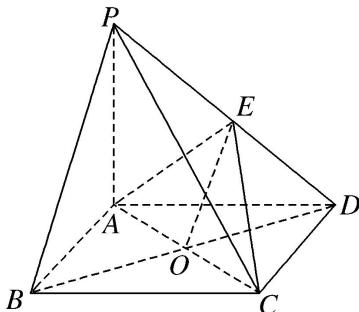

> [!faq]- 《专题10 立体几何中的面积与体积问题-立体几何（文科）》例题解析
>
> > [!success]- **【答案】** 详见解析
>
> > [!note]- **【分析】**
> > 本题未单列分析。
>
> > [!note]- **【解析】**
> > (1)证明： $PB / /$ 平面ACE；
> > (2)设 $PA = 1$ ， $AD = \sqrt{3}$ ， $PC = PD$ ，求三棱锥 $P - ACE$ 的体积.
> > 
> > 12. 解析
> > (1) 连接 $BD$ 交 $AC$ 于点 $O$ , 连接 $OE$ .
> > 在 $\triangle PBD$ 中，PE=DE，BO=DO，所以PB//OE.
> > 又 $OE \subset$ 平面 ACE， $PB \not\subset$ 平面 ACE，所以 PB // 平面 ACE.
> > 
> > (2)由题意得 AC=AD，所以 $V_{P-ACE}=\frac{1}{2}V_{P-ACD}=\frac{1}{4}V_{P-ABCD}=\frac{1}{4}\times\frac{1}{3}S_{\square ABCD}\cdot PA=\frac{1}{4}\times\frac{1}{3}\times2\times\frac{\sqrt{3}}{4}\times(\sqrt{3})^{2}\times1=\frac{\sqrt{3}}{8}$ .
