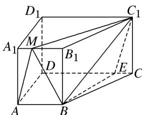
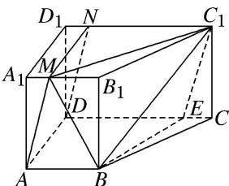

> [!faq]- 《专题10 立体几何中的面积与体积问题-立体几何（文科）》例题解析
>
> > [!success]- **【答案】** 详见解析
>
> > [!note]- **【分析】**
> > 本题未单列分析。
>
> > [!note]- **【解析】**
> > (1)试确定点 E 的位置，并说明理由；
> > (2)求三棱锥 $M-BC_{1}E$ 的体积.
> > 13. 解析
> > (1)点 $E$ 在线段 $CD$ 上且 $EC = 1$ , 理由如下:
> > 
> > 在棱 $C_{1}D_{1}$ 上取点 N，使得 $D_{1}N=A_{1}M=1$ ，连接 MN，DN，
> > 因为 $D_{1}N / / A_{1}M$ ，所以四边形 $D_{1}NMA_{1}$ 为平行四边形，所以 $MN \underline{\underline{\underline{\underline{\underline{A}}}}} A_{1}D_{1} \underline{\underline{\underline{\underline{A}}}} AD.$
> > 所以四边形 AMND 为平行四边形，所以 AM//DN.
> > 因为 CE=1，所以易知 $DN \parallel EC_{1}$ ，所以 $AM \parallel EC_{1}$ ，
> > 又 $AM \not\subset$ 平面 $BC_{1}E$ ， $EC_{1} \subset$ 平面 $BC_{1}E$ ，所以 $AM \parallel$ 平面 $BC_{1}E$ .
> > 故点 E 在线段 CD 上且 EC=1.
> > 
> > (2)由
> > (1)知， $AM / /$ 平面 $BC_{1}E$ ，所以 $V_{M - BC_1E} = V_{A - BC_1E} = V_{C_1 - ABE} = \frac{1}{3}\times \left(\frac{1}{2}\times 3\times 3\right)\times 4 = 6.$
