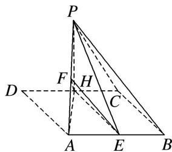

> [!faq]- 《专题10 立体几何中的面积与体积问题-立体几何（文科）》例题解析
>
> > [!success]- **【答案】** 详见解析
>
> > [!note]- **【分析】**
> > 本题未单列分析。
>
> > [!note]- **【解析】**
> > (1)求证：平面 $PBC \parallel$ 平面 $EFH$ ;
> > (2)若三棱锥 P-EFH 的体积等于 $\frac{\sqrt{3}}{12}$ ，求 a 的值.
> > 
> > 14. 解析
> > (1)因为在菱形 $ABCD$ 中, $E$ , $H$ 分别为 $AB$ , $CD$ 的中点, 所以 $BE \parallel CH$ 且 $BE = CH$ , 所以四边形 $BCHE$ 为平行四边形, 则 $BC \parallel EH$ ,
> > 又 $EH \nmid$ 平面 $PBC$ ，所以 $EH \parallel$ 平面 $PBC$ 。因为点 $E$ ， $F$ 分别为 $AB$ ， $AP$ 的中点，所以 $EF \parallel BP$ ，又 $EF \nmid$ 平面 $PBC$ ，所以 $EF \parallel$ 平面 $PBC$ 。又 $EF \cap EH = E$ ，所以平面 $PBC \parallel$ 平面 $EFH$ 。
> > (2)在菱形 ABCD 中， $\angle D=60^{\circ}$ ，则 $\triangle ACD$ 为正三角形，
> > 所以 $AH \perp CD$ ，DH = PH = CH = $\frac{1}{2}a$ ， $AH = \frac{\sqrt{3}}{2}a$ ，折叠后， $PH \perp AH$ ，
> > 又平面 $PHA \perp$ 平面 ABCH，平面 $PHA \cap$ 平面 ABCH = AH， $PH \subset$ 平面 PHA，从而 $PH \perp$ 平面 ABCH。在 $\triangle PAE$ 中，点 F 为 AP 的中点，则 $S_{\triangle PEF} = S_{\triangle AEF}$ ，
> > 所以 $V_{H-PEF}=V_{H-AEF}=\frac{1}{2}V_{H-PAE}=\frac{1}{2}V_{P-AEH}=\frac{1}{2}\times\frac{1}{3}S_{\triangle AEH}.PH=\frac{1}{2}\times\frac{1}{3}\times\frac{1}{2}\times\frac{1}{2}a\times\frac{\sqrt{3}}{2}a\times\frac{1}{2}a=\frac{\sqrt{3}}{96}a^{3}=\frac{\sqrt{3}}{12},$ 所以 $a^{3}=8$ ，故 a=2.
> > ## 2. 线线垂直+体积模型
> > 【例题选讲】
