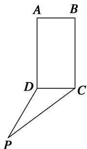
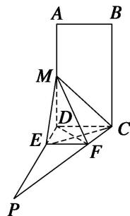
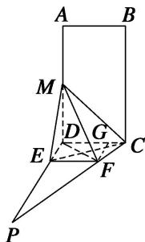

> [!faq]- 《专题10 立体几何中的面积与体积问题-立体几何（文科）》例题解析
>
> > [!success]- **【答案】** 详见解析
>
> > [!note]- **【分析】**
> > 本题未单列分析。
>
> > [!note]- **【解析】**
> > (1)，四边形ABCD为矩形， $PD\perp$ 平面ABCD， $AB = 1$ ， $BC = PC = 2$ ，作如图
> > (2)折叠，折痕 $EF / / DC$ 。其中点 $E$ ， $F$ 分别在线段 $PD$ ， $PC$ 上，沿 $EF$ 折叠后点 $P$ 叠在线段 $AD$ 上的点记为 $M$ 并且 $MF\perp CF$
> > (1)证明： $CF \perp$ 平面 MDF;
> > (2)求三棱锥 M-CDE 的体积.
> > 
> > 
> > (1)
> > (2)
> > 3. 解析
> > (1) 因为 $PD \perp$ 平面 $ABCD$ , $AD \subset$ 平面 $ABCD$ , 所以 $PD \perp AD$ .
> > 又因为 ABCD 是矩形， $CD \perp AD$ ，PD 与 CD 交于点 D，所以 $AD \perp$ 平面 PCD。又 $CF \subset$ 平面 PCD，所以 $AD \perp CF$ ，即 $MD \perp CF$ 。又 $MF \perp CF$ ， $MD \cap MF = M$ ，所以 $CF \perp$ 平面 MDF。
> > 
> > (2)因为 $PD \perp DC$ ，BC=2，CD=1， $\angle PCD=60^{\circ}$ ，所以 $PD=\sqrt{3}$ ，由
> > (1)知 $FD \perp CF$ ，
> > 在直角三角形 DCF 中， $CF=\frac{1}{2}CD=\frac{1}{2}$ . 过点 F 作 $FG \perp CD$ 交 CD 于点 G，得
> > $FG=FC\sin60^{\circ}=\frac{1}{2}\times\frac{\sqrt{3}}{2}=\frac{\sqrt{3}}{4}$ ，所以 $DE=FG=\frac{\sqrt{3}}{4}$ ,
> > 故 $ME = PE = \sqrt{3} -\frac{\sqrt{3}}{4} = \frac{3\sqrt{3}}{4}$ 所以 $MD = \sqrt{ME^2 - DE^2} = \sqrt{\frac{3\sqrt{3}}{4}^2 - \frac{\sqrt{3}}{4}^2} = \frac{\sqrt{6}}{2}.$
> > $S_{\triangle CDE} = \frac{1}{2} DE\cdot DC = \frac{1}{2}\times \frac{\sqrt{3}}{4}\times 1 = \frac{\sqrt{3}}{8}.$ 故 $V_{M - CDE} = \frac{1}{3} MD\cdot S_{\triangle CDE} = \frac{1}{3}\times \frac{\sqrt{6}}{2}\times \frac{\sqrt{3}}{8} = \frac{\sqrt{2}}{16}.$
