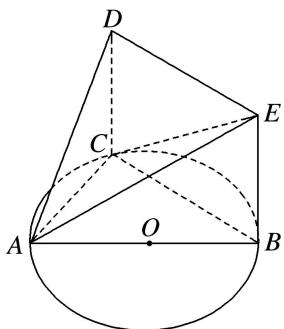
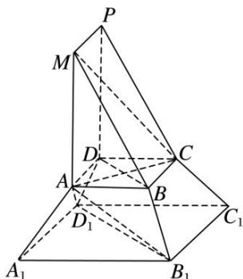

> [!faq]- 《专题10 立体几何中的面积与体积问题-立体几何（文科）》例题解析
>
> > [!success]- **【答案】** 详见解析
>
> > [!note]- **【分析】**
> > 本题未单列分析。
>
> > [!note]- **【解析】**
> > (1)求证： $DE \perp$ 平面 ACD;
> > (2)设 $AC = x$ ， $V(x)$ 表示三棱锥 $B - ACE$ 的体积，求函数 $V(x)$ 的解析式及最大值.
> > 
> > 4. 解析
> > (1)∵四边形 DCBE 为平行四边形，∴CD∥BE，BC∥DE.
> > ∵DC⊥平面ABC，BC⊂平面ABC，∴DC⊥BC.
> > ∵AB是圆O的直径，∴BC⊥AC，且DC∩AC=C，DC，AC⊂平面ADC，
> > ∴BC⊥平面ADC. ∵DE∥BC, ∴DE⊥平面ADC.
> > (2)∵DC⊥平面ABC，∴BE⊥平面ABC．在Rt△ABE中，AB=2，EB= $\sqrt{3}$ .
> > 在 Rt△ABC 中，∵AC=x，∴BC= $\sqrt{4-x^{2}}(0<x<2)$ ，∴ $S_{\triangle ABC}=\frac{1}{2}AC\cdot BC=\frac{1}{2}x\cdot\sqrt{4-x^{2}}$
> > $$
> > \therefore V (x) = V _ {\text {三棱锥} E - A B C} = \frac {\sqrt {3}}{6} x \cdot \sqrt {4 - x ^ {2}} (0 <   x <   2). \quad \because x ^ {2} (4 - x ^ {2}) \leq \left(\frac {x ^ {2} + 4 - x ^ {2}}{2}\right) ^ {2} = 4,
> > $$
> > 当且仅当 $x^{2}=4-x^{2}$ ，即 $x=\sqrt{2}$ 时取等号，∴当 $x=\sqrt{2}$ 时，体积有最大值 $\frac{\sqrt{3}}{3}$ .
> > 5.《九章算术》是我国古代内容极为丰富的数学名著，书中将底面为直角三角形的直棱柱称为堑堵，将底面为矩形的棱台称为刍童．在如图所示的堑堵 ABM—DCP 与刍童 ABCD— $A_{1}B_{1}C_{1}D_{1}$ 的组合体中，AB =AD， $A_{1}B_{1}=A_{1}D_{1}$ ．台体体积公式： $V=\frac{1}{3}(S'+\sqrt{S'S}+S)h$ ，其中 $S'$ ，S 分别为台体上、下底面的面积，h 为台体的高．
> > (1)证明： $BD \perp$ 平面 MAC;
> > (2)若 $AB = 1$ ， $A_{1}D_{1} = 2$ ， $MA = \sqrt{3}$ ，三棱锥 $A - A_{1}B_{1}D_{1}$ 的体积 $V' = \frac{2\sqrt{3}}{3}$ ，求该组合体的体积.
> > 
> > 5. 解析
> > (1)由题意可知 $ABM—DCP$ 是底面为直角三角形的直棱柱， $\therefore AD \perp$ 平面 $MAB$ ， $\therefore AD \perp MA$ ，又 $MA \perp AB$ ， $AD \cap AB = A$ ， $AD$ ， $AB \subset$ 平面 $ABCD$ ， $\therefore MA \perp$ 平面 $ABCD$ ， $\therefore MA \perp BD$ 。又 $AB = AD$ ， $\therefore$ 四边形 $ABCD$ 为正方形， $\therefore BD \perp AC$ ，又 $MA \cap AC = A$ ， $MA$ ， $AC \subset$ 平面 $MAC$ ， $\therefore BD \perp$ 平面 $MAC$ 。
> > (2)设刍童 ABCD— $A_{1}B_{1}C_{1}D_{1}$ 的高为 h，则三棱锥 $A—A_{1}B_{1}D_{1}$ 的体积 $V'=\frac{1}{3}\times\frac{1}{2}\times2\times2\times h=\frac{2\sqrt{3}}{3}$
> > ∴ $h=\sqrt{3}$ ，故该组合体的体积 $V=\frac{1}{2}\times1\times\sqrt{3}\times1+\frac{1}{3}\times(1^{2}+2^{2}+\sqrt{1^{2}\times2^{2}})\times\sqrt{3}=\frac{\sqrt{3}}{2}+\frac{7\sqrt{3}}{3}=\frac{17\sqrt{3}}{6}$ .
